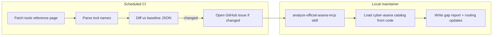

# Asana MCP Co-Install and Gap Analysis

## Summary

Document co-installation of official Asana MCP + cyber-asana with routing guidance, add a hybrid gap-analysis toolchain (script + committed baseline + internal skill), and schedule CI to detect official catalog changes and open GitHub issues for local AI-driven analysis.

**Origin:** Planned in cyber-skills workspace; implementation belongs in this repo.

## Context

- **Tool-name collisions:** Already safe. Official V2 uses names like `create_tasks`; cyber-asana uses `asana_task_create`. Different config keys (`asana` vs `cyber-asana`) are still required.
- **Auth is not shared:** Official MCP uses OAuth (`ASANA_CLIENT_ID`, `ASANA_CLIENT_SECRET`); cyber-asana uses a PAT (`ASANA_TOKEN`). There is no official `ASANA_TOKEN` — do not try to align on one env var (see Part 1.0).
- **Real gap:** Semantic overlap and routing — agents must know which server to call.
- **Detection source:** Hybrid — scrape [Asana MCP Tools Reference](https://developers.asana.com/docs/mcp-tools-reference) for scheduled CI; optional manual `tools/list` refresh when OAuth is available.



## Implementation todos

Phased order — see Part 8 and Part 12 for commit boundaries and acceptance criteria.

- [ ] **Phase A — Docs:** readme/CONTRIBUTING key rename + dual-MCP section + routing table in readme; skill/AGENTS updates (no separate user-facing routing file)
- [ ] **Phase B — Tooling:** `data/*.json` baselines; `src/gap-analysis/` + scripts + tests
- [ ] **Phase C — Maintainer UX:** `.agents/skills/analyze-official-asana-mcp/SKILL.md`; GitHub issue template
- [ ] **Phase D — CI:** `mcp-catalog-watch.yml` (weekly + dry-run); PR `check:mcp-gap` job

---

## Part 1: Co-install documentation and routing

### 1.0 Authentication — no `ASANA_TOKEN` on official MCP

Per [Connecting Coding Clients to Asana's V2 server](https://developers.asana.com/docs/connecting-mcp-clients-to-asanas-v2-server), official Asana MCP auth is **OAuth**, not a PAT env var:

| Server | Auth model | Env vars | Token storage |
| --- | --- | --- | --- |
| Official `asana` | OAuth 2.0 (pre-registered MCP app) | `ASANA_CLIENT_ID`, `ASANA_CLIENT_SECRET` | Host-managed (Cursor keychain, `~/.mcp-auth/`, Claude keychain, etc.) |
| `cyber-asana` | Personal access token | `ASANA_TOKEN`, optional `ASANA_WORKSPACE` | Passed in MCP `env` or shell |

Important constraints (from Asana docs):

- **MCP OAuth tokens cannot be used as `ASANA_TOKEN`** for the REST API or cyber-asana.
- **PATs cannot be substituted** for official MCP OAuth — different token types, different servers.
- Official MCP is **workspace-scoped at authorization**; cyber-asana still needs `ASANA_WORKSPACE` (or per-call GIDs) for many tools.

**Plan implication:** Document both credential sets side by side in co-install examples. Do **not** rename cyber-asana's `ASANA_TOKEN` or expect one env var to serve both servers.

Cursor dual-config example (correct env split):

```json
{
  "mcpServers": {
    "asana": {
      "url": "https://mcp.asana.com/v2/mcp",
      "auth": {
        "CLIENT_ID": "${env:ASANA_CLIENT_ID}",
        "CLIENT_SECRET": "${env:ASANA_CLIENT_SECRET}"
      }
    },
    "cyber-asana": {
      "command": "node",
      "args": ["-e", "import('cyber-asana/mcp')"],
      "env": {
        "ASANA_TOKEN": "${ASANA_TOKEN}",
        "ASANA_WORKSPACE": "${ASANA_WORKSPACE}"
      }
    }
  }
}
```

Shell profile for dual setup:

```sh
export ASANA_CLIENT_ID="..."      # official MCP OAuth app
export ASANA_CLIENT_SECRET="..."  # official MCP OAuth app
export ASANA_TOKEN="..."          # cyber-asana PAT (separate; create at app.asana.com → My Apps)
export ASANA_WORKSPACE="..."      # cyber-asana default workspace (optional)
```

Update `skills/init-asana/SKILL.md` to cover **both** credential paths when user wants dual MCP.

### 1.1 Update MCP config examples

In `readme.md` and `CONTRIBUTING.md`:

- Rename cyber-asana config key from `"asana"` to `"cyber-asana"` in all cyber-asana-only `mcpServers` examples.
- Add subsection **Using alongside official Asana MCP** with the dual-config block above (host-specific OAuth details → link to Asana docs).
- Explicitly state: **no tool-name collision**; **separate auth** (`ASANA_CLIENT_ID`/`SECRET` vs `ASANA_TOKEN`).

### 1.2 Routing guidance — in readme, not a hidden doc file

**Problem:** `docs/mcp-routing.md` is repo-only. The npm package ships `dist/` only (`package.json` `files`), so `npm install cyber-asana` users never see `docs/`.

**Decision:** Put the routing table and default rule in **`readme.md`** under MCP Server (visible on GitHub and npmjs.com). No separate user-facing routing file.

| Prefer official `asana` MCP | Prefer `cyber-asana` MCP |
| --- | --- |
| `search_objects`, `get_status_overview` | `asana_url_parse`, repo config (`.agents/cyber-asana.json`) |
| Interactive previews (`create_task_preview`, etc.) | Subtasks, dependencies, followers, section placement |
| New MCP-only capabilities Asana ships first | `asana_task_scan_todos`, `asana_project_export`, rich REST-backed writes |
| Simple reads when V2 coverage suffices | Goals/tags/portfolios CRUD beyond V2 scope |

Default rule (in readme): if both can do the job, prefer **official for discovery/status** and **cyber-asana for write-heavy automation**.

**Who reads what:**

| Audience | Routing source |
| --- | --- |
| End user / npm installer | `readme.md` MCP section |
| Agent with skills installed from repo | Inline rules in `skills/*.md` (self-contained; link to readme anchor `#using-alongside-official-asana-mcp`) |
| Maintainer after catalog change | `.agents/skills/analyze-official-asana-mcp` updates readme table + overlap map |
| Contributor in this repo | `AGENTS.md` pointer → readme anchor |

Optional: keep a short `docs/mcp-routing.md` as a **maintainer mirror** of the readme table for gap-analysis PRs only — not linked from user-facing docs. Prefer single source of truth in readme unless duplication becomes painful.

### 1.3 Skill routing updates

Update these skills with **inline** routing (not “see docs/mcp-routing.md”):

- `skills/create-asana-task/SKILL.md` — “When both MCPs connected”: default `asana_task_create`; official `create_tasks` only for preview flow or when cyber-asana unavailable.
- `skills/init-asana/SKILL.md` — dual MCP step: OAuth app + `ASANA_CLIENT_ID`/`SECRET` for official; PAT + `ASANA_TOKEN` for cyber-asana; link to readme anchor.
- `AGENTS.md` — short pointer: dual MCP supported; routing in readme MCP section.

---

## Part 2: Gap analysis toolchain

### 2.1 Committed baseline

Add `data/official-asana-mcp-baseline.json`:

```json
{
  "source": "https://developers.asana.com/docs/mcp-tools-reference",
  "fetched_at": "2026-05-25",
  "tools": ["search_objects", "create_tasks", "..."]
}
```

Also add `data/cyber-asana-mcp-catalog.json` — generated, committed snapshot of cyber-asana tools for diffing in issues/PRs.

### 2.2 TypeScript scripts (new module)

Add `src/gap-analysis/`:

| Script / command | Purpose |
| --- | --- |
| `pnpm gap:catalog` | Extract cyber-asana tool names from `src/**/mcp.ts` (regex on `server.tool('asana_*'`) + write/update `data/cyber-asana-mcp-catalog.json` |
| `pnpm gap:fetch-official` | Fetch tools reference page, parse backtick tool names from markdown tables, emit JSON to stdout or `--write` baseline |
| `pnpm gap:diff-official` | Compare fetched catalog vs committed baseline; exit 1 if added/removed tools |
| `pnpm gap:report` | Produce human + JSON gap report: official-only / cyber-only / overlapping (heuristic name mapping) |

Wire into `package.json`:

```json
"gap:catalog": "tsx src/gap-analysis/catalog.ts",
"gap:fetch-official": "tsx src/gap-analysis/fetch-official.ts",
"gap:diff-official": "tsx src/gap-analysis/diff-official.ts",
"gap:report": "tsx src/gap-analysis/report.ts",
"check:mcp-gap": "pnpm gap:catalog && pnpm gap:diff-official"
```

**Tests:** Vitest fixtures with sample markdown HTML snippets for parser; catalog extraction test; diff added/removed/unchanged.

**Optional manual path:** `pnpm gap:fetch-official --via-mcp` (later) — call `tools/list` when `ASANA_MCP_*` OAuth env is set; merge into baseline with `"source": "tools/list"`. Not required for v1 CI.

### 2.3 Internal skill for local AI analysis

New: `.agents/skills/analyze-official-asana-mcp/SKILL.md`

```yaml
metadata:
  internal: true
description: "Internal skill: Run when official Asana MCP catalog changed or user asks for MCP gap analysis. Compares official baseline to cyber-asana catalog and produces routing + implementation recommendations."
```

Workflow steps:

1. Run `pnpm gap:report --json` and read output.
2. Classify each delta: **official-only** (document routing to official), **cyber-asana advantage** (keep), **overlap** (update routing doc/skills), **cyber-asana gap** (candidate for REST API implementation via `update-asana-sdk` pattern).
3. Update readme MCP routing table and affected skills.
4. If baseline was stale, run `pnpm gap:fetch-official --write` and commit updated baseline in a separate commit.
5. Output summary table for maintainer review.

Cross-link existing `.agents/skills/update-asana-sdk/SKILL.md` for implementation work after analysis.

### 2.4 Issue template

New: `.github/ISSUE_TEMPLATE/mcp-gap-analysis.md` with checklist:

- Run `analyze-official-asana-mcp` skill
- Update routing doc
- Update baseline JSON
- Decide if cyber-asana needs new tools vs docs-only routing change

---

## Part 3: Scheduled CI + GitHub issue

New workflow: `.github/workflows/mcp-catalog-watch.yml`

```yaml
on:
  schedule:
    - cron: '0 9 * * 1'  # weekly Monday 09:00 UTC
  workflow_dispatch:
```

Steps:

1. `pnpm gap:fetch-official --json > /tmp/official.json`
2. `pnpm gap:diff-official /tmp/official.json` (non-zero on change)
3. On change: `gh issue create` with:
   - Title: `chore: official Asana MCP catalog changed`
   - Labels: `mcp-gap-analysis`, `maintenance`
   - Body: added/removed tool lists + link to run internal skill
   - Dedup: search open issues with label `mcp-gap-analysis` before creating

Permissions: `contents: read`, `issues: write`; uses default `GITHUB_TOKEN`.

Add `pnpm check:mcp-gap` to PR CI optionally (fails if someone updates cyber-asana tools without refreshing `data/cyber-asana-mcp-catalog.json`) — lightweight guard, not full gap analysis.

---

## Part 4: GitHub Copilot — what it can and cannot do

**Do not rely on Copilot for detection.** Copilot is not a scheduled monitor; it cannot scrape Asana docs or call `tools/list` on a cron without the same GitHub Actions shell you would build anyway.

**Good Copilot use (optional follow-up):**

- After CI opens an issue with a structured diff, a maintainer can assign **GitHub Copilot coding agent** (if enabled on the org/repo) to mechanical follow-ups: update baseline JSON, refresh readme tool table, add routing table rows.
- Copilot is weaker at strategic gap analysis (which server should own which workflow); keep that in the **internal skill** run locally.

**Recommended split:**

| Task | Owner |
| --- | --- |
| Detect catalog change | Scheduled GHA + `gap:diff-official` |
| Analyze impact + routing | Internal skill + human review |
| Implement new cyber-asana tools | `update-asana-sdk` skill / normal PR |
| Mechanical doc/baseline updates | Copilot optional |

---

## Part 5: Verification

- `pnpm verify` (existing)
- New: `pnpm vitest run src/gap-analysis`
- Manual: run `pnpm gap:report` with both MCPs configured locally; confirm routing doc matches report
- Manual: trigger `workflow_dispatch` once to validate issue creation (or dry-run mode that prints would-be issue body)

---

## Out of scope (v1)

- Renaming cyber-asana tools to `cyber_asana_*` (unnecessary while official V2 uses different naming)
- Publishing gap-analysis skill to npm (stays `.agents/skills/` internal)
- Full schema-level diff of tool parameters (name-level diff + heuristic overlap is enough for v1)
- Auto-assigning Copilot on every detected change

---

## Part 6: Initial catalog snapshot (2026-05-25)

Baseline for `data/official-asana-mcp-baseline.json` — scraped from [MCP Tools Reference](https://developers.asana.com/docs/mcp-tools-reference).

### Official Asana MCP V2 (25 tools)

| Category | Tools |
| --- | --- |
| Read (16) | `search_objects`, `get_task`, `get_tasks`, `get_my_tasks`, `search_tasks`, `get_project`, `get_projects`, `get_portfolio`, `get_portfolios`, `get_items_for_portfolio`, `get_status_overview`, `get_attachments`, `get_user`, `get_me`, `get_users`, `get_teams` |
| Write (6) | `create_tasks`, `create_project`, `update_tasks`, `delete_task`, `add_comment`, `create_project_status_update` |
| Interactive (3) | `create_task_preview`, `create_project_preview`, `search_tasks_preview` |

Notes:

- V2 dropped the `asana_` prefix (`create_task` → `create_tasks` for batch).
- No dedicated goals, tags, sections, dependencies, or workspace list tools — goals via `search_objects`; sections implied in project reads.
- OAuth workspace-scoped; no `workspace_gid` on most calls.

### cyber-asana MCP (65 registered tools)

Extracted from `src/**/mcp.ts` + `src/url-mcp.ts`:

| Domain | Count | Tools |
| --- | ---: | --- |
| workspace | 2 | `asana_workspace_list`, `asana_workspace_get` |
| project | 8 | `asana_project_list`, `get`, `counts`, `search`, `create`, `update`, `delete`, `export` |
| task | 21 | `list`, `my_tasks`, `subtask_list/create`, `get`, `get_many`, `create`, `update`, `delete`, `search`, follower/project/dependency/dependent ops, `scan_todos` |
| section | 5 | `list`, `get`, `create`, `update`, `delete` |
| user | 3 | `list`, `get`, `me` |
| team | 2 | `list`, `get` |
| portfolio | 5 | `list`, `get`, `create`, `update`, `delete` |
| goal | 5 | `list`, `get`, `create`, `update`, `delete` |
| tag | 9 | `list`, `get`, `create`, `update`, `delete`, `list_for_task`, `list_tasks`, `add_to_task`, `remove_from_task` |
| attachment | 2 | `list`, `get` |
| story | 2 | `list`, `create` |
| comment | 2 | `list`, `create` (aliases for story) |
| url | 1 | `asana_url_parse` |

### First-pass gap summary

| Bucket | Count | Examples |
| --- | ---: | --- |
| Official-only | ~10 | `search_objects`, `get_status_overview`, `create_*_preview`, `create_project_status_update`, `get_items_for_portfolio` |
| cyber-asana-only | ~45 | goals/tags/sections CRUD, dependencies, followers, `asana_url_parse`, `asana_project_export`, `asana_task_scan_todos`, workspace list |
| Overlap (heuristic) | ~15 | task/project/user CRUD and list/search pairs — see Part 7 |

---

## Part 7: Overlap heuristic mapping

`pnpm gap:report` uses a static map in `src/gap-analysis/overlap-map.ts` (maintained by humans, not auto-generated). Each entry: `{ official, cyber, confidence: 'high' | 'partial' }`.

### High-confidence pairs (document in routing table)

| Official | cyber-asana | Routing note |
| --- | --- | --- |
| `get_task` | `asana_task_get` | Prefer official for OAuth sessions; cyber-asana for PAT + extra opt_fields patterns |
| `get_tasks` | `asana_task_list` | Official requires filter context; cyber-asana lists by project with pagination helpers |
| `get_my_tasks` | `asana_task_my_tasks` | Equivalent intent |
| `search_tasks` | `asana_task_search` | Official Premium-only; cyber-asana REST search always available |
| `create_tasks` | `asana_task_create` | Official batch (50); cyber-asana single + richer fields (html_notes, custom_fields, multi-project) |
| `update_tasks` | `asana_task_update` | Official batch; cyber-asana single + dependency/parent/clear flags |
| `delete_task` | `asana_task_delete` | Equivalent |
| `add_comment` | `asana_comment_create` | cyber-asana adds `template` interpolation |
| `get_project` | `asana_project_get` | Equivalent |
| `get_projects` | `asana_project_list` | cyber-asana paginated list with `fetch_all` |
| `create_project` | `asana_project_create` | Official can bundle sections/tasks at create |
| `get_portfolio` | `asana_portfolio_get` | Equivalent |
| `get_portfolios` | `asana_portfolio_list` | Equivalent |
| `get_attachments` | `asana_attachment_list` | cyber-asana task-scoped only |
| `get_user` / `get_me` | `asana_user_get` / `asana_user_me` | Equivalent |
| `get_users` | `asana_user_list` | Equivalent |
| `get_teams` | `asana_team_list` | Equivalent |

### Partial / no map (report as distinct)

- `search_objects` — no cyber-asana equivalent (use official for discovery)
- `get_status_overview` — no equivalent
- `create_project_status_update` — no equivalent
- Interactive previews — no equivalent
- `asana_url_parse`, repo config, export, scan_todos, goals/tags/sections/dependencies — cyber-asana-only

Report output shape:

```json
{
  "official_only": ["search_objects", "..."],
  "cyber_only": ["asana_goal_list", "..."],
  "overlap": [{ "official": "create_tasks", "cyber": "asana_task_create", "confidence": "high" }],
  "unmapped_official": [],
  "unmapped_cyber": ["asana_tag_update", "..."]
}
```

---

## Part 8: Implementation phases and commit boundaries

Execute in order; each phase is one or more conventional commits per AGENTS.md.

### Phase A — Docs-only co-install (no code)

**Goal:** Users can configure both MCPs without confusion.

| Commit | Files | Message |
| --- | --- | --- |
| A1 | `readme.md`, `CONTRIBUTING.md` | `docs: rename MCP config key, dual-MCP auth, and routing table in readme` |
| A2 | `skills/create-asana-task/SKILL.md`, `skills/init-asana/SKILL.md`, `AGENTS.md` | `docs: add dual-MCP routing pointers to skills and AGENTS` |

**A1 details:**

- Replace `"asana"` → `"cyber-asana"` in all cyber-asana-only examples (`readme.md` lines ~377–444, `CONTRIBUTING.md` ~42, Claude Code `claude mcp add` example).
- Add migration note: *If you already use key `"asana"` for cyber-asana, rename to `"cyber-asana"` when adding official `"asana"` — not a package breaking change, but avoids host confusion.*
- Codex TOML: `[mcp_servers.cyber-asana]` (was `.asana`).
- Dual-MCP JSON block per Part 1.1.

**A2 `init-asana` addition — new step 7:**

```markdown
### 7. Optional — dual MCP with official Asana

Official Asana MCP uses OAuth (`ASANA_CLIENT_ID`, `ASANA_CLIENT_SECRET`) — not `ASANA_TOKEN`.
cyber-asana uses a PAT (`ASANA_TOKEN`). Both can run together with separate config keys:
- `asana` — official OAuth MCP
- `cyber-asana` — this package (PAT)

See readme [Using alongside official Asana MCP](#using-alongside-official-asana-mcp) for routing.
```

### Phase B — Gap-analysis module + baselines

**Goal:** Local tooling works; tests green.

| Commit | Files | Message |
| --- | --- | --- |
| B1 | `data/official-asana-mcp-baseline.json`, `data/cyber-asana-mcp-catalog.json` | `chore: seed MCP catalog baseline JSON files` |
| B2 | `src/gap-analysis/*`, `package.json` scripts | `feat: add MCP gap-analysis catalog and diff tooling` |
| B3 | `src/gap-analysis/*.test.ts` | `test: add gap-analysis parser and diff tests` |

**Module layout:**

```
src/gap-analysis/
├── types.ts           # McpCatalog, DiffResult, GapReport
├── catalog.ts         # extract cyber-asana tools from src/**/mcp.ts
├── fetch-official.ts  # fetch + parse developers.asana.com page
├── parse-tools-md.ts  # shared markdown table parser (backtick cells in Tool column)
├── diff-official.ts   # compare two McpCatalog JSON files
├── overlap-map.ts     # static official↔cyber pairs (Part 7)
├── report.ts          # gap:report CLI
└── cli-utils.ts       # --json, --write, exit codes
```

**Catalog extraction rules (`catalog.ts`):**

1. Glob `src/**/mcp.ts` and `src/url-mcp.ts`.
2. Match `server.tool(\s*['"\`]asana_[a-z0-9_]+['"\`]` and `` `asana_${prefix}_*` `` template literals — for templates, expand known prefixes from `stories/mcp.ts` (`story`, `comment`) at extract time.
3. Sort unique, write `{ source: "src/**/mcp.ts", generated_at, tools: [...] }`.
4. Fail if count drops unexpectedly without `--force` (sanity check ≥ 60 tools).

**Official fetch parser (`parse-tools-md.ts`):**

1. `fetch(url)` with `User-Agent: cyber-asana-gap-analysis`.
2. Prefer parsing markdown tool names from table rows: first column backticks `` `tool_name` ``.
3. Fallback: regex on raw HTML `` `<code>tool_name</code>` `` in first `<td>` if page structure shifts.
4. Deduplicate; validate count within expected range (20–40) — warn if outside.

**CLI exit codes:**

| Command | Exit 0 | Exit 1 |
| --- | --- | --- |
| `gap:diff-official` | catalogs match | added/removed tools |
| `gap:catalog` | wrote file | parse error |
| `gap:report` | always 0 | — |

### Phase C — Internal skill + issue template

| Commit | Files | Message |
| --- | --- | --- |
| C1 | `.agents/skills/analyze-official-asana-mcp/SKILL.md` | `docs: add internal MCP gap analysis skill` |
| C2 | `.github/ISSUE_TEMPLATE/mcp-gap-analysis.yml` | `chore: add MCP gap analysis issue template` |

Use YAML issue template (repo has no templates yet). Labels `mcp-gap-analysis` and `maintenance` must be created manually or via `gh label create` in workflow first-run.

### Phase D — CI watch workflow

| Commit | Files | Message |
| --- | --- | --- |
| D1 | `.github/workflows/mcp-catalog-watch.yml` | `ci: watch official Asana MCP catalog for changes` |
| D2 | `.github/workflows/pull-request.yml` or repo-local job | `ci: check cyber-asana MCP catalog freshness on PR` |

**PR check (D2):** Add a job to `pull-request.yml` (not only reusable `pnpm-verify`):

```yaml
mcp-catalog:
  runs-on: ubuntu-latest
  steps:
    - uses: actions/checkout@v4
    - uses: pnpm/action-setup@v4
    - run: pnpm install --frozen-lockfile
    - run: pnpm check:mcp-gap
```

Fails when `src/**/mcp.ts` changes but `data/cyber-asana-mcp-catalog.json` was not regenerated.

**Watch workflow issue body template:**

```markdown
## Official Asana MCP catalog changed

Detected by weekly `mcp-catalog-watch` workflow.

### Added
- `new_tool_name`

### Removed
- `old_tool_name`

### Maintainer checklist
- [ ] Run `.agents/skills/analyze-official-asana-mcp` locally
- [ ] Update readme MCP routing table if routing changes
- [ ] Refresh `data/official-asana-mcp-baseline.json`
- [ ] Decide: docs-only vs new cyber-asana tools (`update-asana-sdk` skill)

/compare with committed baseline at \`data/official-asana-mcp-baseline.json\`
```

**Dedup logic:** Before `gh issue create`, run:

```sh
gh issue list --label mcp-gap-analysis --state open --json title --jq '.[].title' | grep -F "official Asana MCP catalog changed" && exit 0
```

---

## Part 9: Technical decisions (resolved)

| Decision | Choice | Rationale |
| --- | --- | --- |
| Config key rename | `"cyber-asana"` for this package | Reserves `"asana"` for official hosted MCP; documented migration, not semver bump |
| Detection source | Scrape docs page in CI | No OAuth secret in GHA; docs page lists stable tool names |
| cyber catalog source | Regex on `mcp.ts` | Single source of truth; no runtime MCP server needed |
| Story/comment aliases | Expand templates at extract | Avoid false "missing" tools when grep hits `` `asana_${prefix}_list` `` |
| Overlap mapping | Static TS map | Name heuristics are fuzzy; human-maintained map beats NLP |
| PR gate | `check:mcp-gap` only | Full gap report is maintainer-driven, not CI-blocking |
| Baseline updates | Manual commit after analysis | CI opens issue; human refreshes baseline — avoids bot commits without review |
| `data/` in npm package | Include in git, exclude from `files` | Baselines are repo maintenance artifacts, not runtime deps |

---

## Part 10: Open questions

1. **Claude Code `claude mcp add` name** — Example uses CLI arg `asana`. Change to `cyber-asana` in docs only, or also add `claude mcp add` dual-setup snippet?
2. **Committed `.cursor/mcp.json`** — Repo has no project MCP file today. Add `.cursor/mcp.json.example` with dual config for contributors?
3. **Label bootstrap** — Create `mcp-gap-analysis` label in repo settings before first workflow run, or add label-creation step to workflow?
4. **Changeset** — Phase B adds CLI scripts (dev-facing). Patch changeset optional; no npm API surface change unless we export gap-analysis (we won't).

---

## Part 11: Acceptance criteria

### Phase A (docs)

- [ ] Every cyber-asana-only MCP example uses key `cyber-asana`
- [ ] Dual-MCP JSON validates in Cursor and Claude Desktop docs paths
- [ ] readme dual-MCP section documents OAuth vs PAT env vars and routing table
- [ ] Skills and AGENTS link to readme anchor, not repo-only docs

### Phase B (tooling)

- [ ] `pnpm gap:catalog` regenerates catalog matching manual count (65 tools)
- [ ] `pnpm gap:fetch-official` prints 25 tools against live docs
- [ ] `pnpm gap:diff-official` exits 1 when baseline tampered in test fixture
- [ ] `pnpm gap:report` emits JSON with all four buckets populated
- [ ] `pnpm verify` passes

### Phase C–D (automation)

- [ ] `workflow_dispatch` on `mcp-catalog-watch` completes (dry-run mode: `--dry-run` flag skips `gh issue create`, prints body)
- [ ] PR touching `src/tasks/mcp.ts` without catalog JSON fails `check:mcp-gap`
- [ ] Internal skill references `update-asana-sdk` for implementation follow-ups

---

## Part 12: Suggested execution order (checklist)

Updated implementation todos with phase tags:

- [ ] **A** Update readme/CONTRIBUTING MCP examples; dual-MCP auth + routing in readme
- [ ] **A** Add routing guidance to `create-asana-task`, `init-asana`, and `AGENTS.md`
- [ ] **B** Seed `data/*.json` baselines from Part 6 snapshot
- [ ] **B** Implement `src/gap-analysis/` + package scripts + tests
- [ ] **C** Add `.agents/skills/analyze-official-asana-mcp/SKILL.md` and issue template
- [ ] **D** Add `mcp-catalog-watch.yml` with weekly cron, deduped issues, dry-run
- [ ] **D** Add `check:mcp-gap` to PR workflow
- [ ] **Verify** Manual `workflow_dispatch` + local `pnpm gap:report` review
