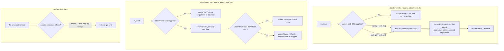

# attachments — reading the files hanging off a task

## What

People drop files on Asana tasks: a screenshot of a bug, a signed contract, a spreadsheet of
numbers. Asana calls each one an **attachment**. An agent working a task usually needs to know two
things about them — *what is attached here?* and *where do I download that one?*

`attachments` answers exactly those two questions and nothing else. It is a **read-only** view of
the files on a task.

The shape of the capability is set by one fact about Asana: an attachment never stands alone. It
always hangs off a **parent object**, and you cannot ask for "all attachments" the way you can ask
for "all workspaces". So listing always needs a parent identifier, and this node accepts exactly
one kind of parent — a **task**. Reading a single attachment, by contrast, needs only the
attachment's own identifier, because at that point the parent is already known.

**Key terms**

- **GID** — Asana's global id for any object; an opaque string, never parsed or arithmetic.
- **Attachment** — a file record hanging off a parent object, carrying a name, a GID, and usually a
  download URL.
- **Parent object** — the Asana object an attachment belongs to. Here, always a task.
- **Download URL** — Asana's link to the file bytes. Asana does not always include it in a
  record, so this node treats it as optional rather than assumed.

**Non-goals.** This node wraps **reading** only — `list` and `get`. Asana can also **upload** a new
attachment to an object and **delete** an existing one; neither is wrapped, on either surface. An
both are known gaps rather than considered cuts. Nothing in the code or history records a decision.
Uploading file bytes is a multipart transfer reaching into the local filesystem, which is a different
capability wearing an attachment-shaped name — but Asana's upload endpoint also accepts an external
URL with no file bytes at all, and that path carries none of the objection. `delete` is a plain
`DELETE /attachments/{gid}` that seven other domains in this package wrap the equivalent of. The node
is read-only because reading is what got built. This node also does **not** accept any parent object
other than a task, even though Asana's list endpoint is parent-generic: projects and portfolios can
carry attachments too, and they are simply not exposed here.

**What this node does not own.** How a paginated list behaves — bare array versus envelope, what
`--all` walks, where `--max-pages` stops — is the shared list contract in
[axi](../axi/README.md), adopted here rather than re-decided. Likewise `--json` / `--toon` output,
empty-state rendering, truncation, and exit-code conventions. This node's only pagination decision
is that `list` is paginated and `get` is not.

## Use Cases

**Subject** — reading the attachments on an Asana task, and reading one attachment by GID, over the
two surfaces (CLI and MCP) that share one `api.ts`.

| Entry point | Trigger | Inputs | Outcome |
|---|---|---|---|
| `attachment list` (CLI) | caller wants the files on a known task | the parent task GID as the flag `--task-gid` (legacy alias `--task`), plus pagination options | the task's attachments, rendered as a Name/ID table in text mode |
| `asana_attachment_list` (MCP) | agent wants the same over MCP | `task_gid`, plus the shared pagination params | the same result, JSON-serialized |
| `attachment get <gid>` (CLI) | caller holds an attachment GID and wants its record, usually for the download URL | the attachment GID, positionally | the unwrapped attachment record, rendered as Name/ID/URL fields in text mode |
| `asana_attachment_get` (MCP) | same, over MCP | `attachment_gid` only | the same record, JSON-serialized |

Both surfaces route through `api.ts` — neither `cli.ts` nor `mcp.ts` calls the Asana SDK directly,
so a change to what an attachment read means lands in one place.

## Logic

The two read groups share no decision, so they are drawn separately. The load-bearing edges:

- **The parent GID is required and is a flag, not a positional.** `list` cannot be called without
  it, and it is never defaulted from the environment. Only a *workspace* GID gets an environment
  default in this package; a task GID never does, because a wrongly-defaulted parent would return
  a plausible-looking list of the wrong task's files.
- **The legacy `--task` alias normalizes to the same parent GID.** Both spellings reach the same
  request; the alias exists so older invocations keep working.
- **The download URL is optional.** Asana omits it on some records. `get` treats a missing URL as
  an empty value rather than an error, and the text rendering then simply has no URL line. Name and
  GID are always there; the URL line appears only when there is a URL to show.

## Scenario map

### `attachment list` / `asana_attachment_list`

| Edge | Path (Given) | Scenario |
|---|---|---|
| parent GID supplied → fetch that task's attachments | a task carrying two attachments | `list returns the attachments of the task GID it was given` |
| legacy alias normalizes to the parent GID | the legacy task flag spelled instead of the current one | `list accepts the legacy task flag as the parent GID` |
| parent GID absent → usage error | no task GID on the invocation | `list without a task GID is a usage error` |
| no environment default for the parent GID (barred) | the workspace environment variable set, no task GID given | `list does not default its parent task GID from the environment` |
| pagination options travel beside the parent GID | a request carrying a page size and an offset token | `list sends its pagination options without disturbing the parent task GID` |
| render Name / ID table | text mode, two attachments | `list renders each attachment's name and GID in text mode` |

### `attachment get` / `asana_attachment_get`

| Edge | Path (Given) | Scenario |
|---|---|---|
| GID supplied → fetch | a GID naming an existing attachment | `get returns the attachment record for the GID it was given` |
| record carries a download URL → render it | text mode, an attachment whose record carries a download URL | `get renders the attachment's name, GID and download URL in text mode` |
| record omits the download URL → drop the URL line | text mode, an attachment whose record omits the download URL | `get omits the URL line when the record carries no download URL` |
| GID absent → usage error | no positional argument | `get without a GID is a usage error` |
| no pagination on a single-record read (barred) | any | `get offers no pagination options` |

### surface boundary

| Edge | Path (Given) | Scenario |
|---|---|---|
| no CLI verb that changes an attachment (barred) | the attachment command group | `the attachment command group offers only list and get` |
| no MCP tool that changes an attachment (barred) | the registered attachment tool set | `the MCP surface registers only the two attachment read tools` |

## References

- Asana API — [Attachments](https://developers.asana.com/reference/attachments) backs two claims:
  that upload and delete are the remaining attachment operations this node deliberately leaves
  unwrapped, and that the list endpoint is parent-generic (it accepts objects other than tasks)
  while this node exposes tasks only.
