# config — where cyber-asana's settings come from

## What

Every `cyber-asana` invocation needs two things the command line rarely carries: a **credential** to
talk to Asana, and, for anything workspace-scoped, a **workspace GID**. Many invocations also want a
third: the GID of a project the repository works with every day. Typing all three on every call is
friction; hard-coding them into commands is worse.

This node is the answer to *where does a value come from*. It has two halves.

The first half is the **repo config** — a small JSON file, `.agents/cyber-asana.json`, committed
alongside the code. It maps human project names to Asana project GIDs, so an agent can turn a name
into a GID without searching the workspace first. The `cyber-asana config` verbs create, read, and
maintain it, and the file is deliberately tiny: a schema version and a list of `{ gid, name }`
entries. Nothing else.

The second half is **resolution precedence** — the order in which a value is looked for. An explicit
input always wins; the environment is consulted only when nothing was passed; and each environment
name has an older alias behind it, tried in a fixed order. The order is the whole contract: get it
wrong and a caller who typed a flag silently gets the machine's ambient setting instead.

The one thing that never appears in the committed file is the **workspace GID**. That is
[design decision 0001](../design/decisions/0001-no-workspace-gid-in-repo-config.md), and the reason
is security, not tidiness. A committed file is world-readable to everyone who can read the git
history, forever. A project GID is already shared casually — it sits in every Asana task URL people
paste into chat. A workspace GID is different: it names the whole organization, so publishing it
widens the blast radius if a token ever leaks, handing an attacker the one identifier they need to
enumerate and abuse the org. Workspace binding therefore stays in private environment configuration
(`ASANA_WORKSPACE`) or in the individual request — a parsed URL, an explicit flag.

**Key terms**

- **GID** — Asana's global id for an object; an opaque digit string, never parsed and never
  arithmetic.
- **Repo config** — the committed file `.agents/cyber-asana.json`, holding `schema_version` and
  `projects`.
- **Registry entry** — one `{ gid, name }` pair inside `projects`.
- **Alias** — an older environment variable name still honored behind the current one.
- **Precedence** — the fixed order in which candidate sources for one value are tried; the first
  non-empty one wins and the rest are never consulted.
- **Git root** — the nearest directory at or above the working directory that contains `.git`. It
  bounds the upward search for the config file.

**Non-goals.** The repo config is **not** a settings file. It stores no token, no workspace GID, no
default output format, no per-user preference. Two separate reasons: a secret must never be
committed, and a workspace GID must not be published, for the blast-radius reason above. Anything
private is an environment variable or a flag, which live outside the repository and outside this
file's schema. Nor is the registry a **cache of Asana**: it holds only a name and a GID, never a
project's fields, so it can never serve a stale answer to a question it was not asked. And it is
**not authoritative** — a name that is not registered is an error the caller handles, not a signal
to go search Asana; searching is [projects](../projects/README.md)' job.

**What this node does not own.** The `--json` / `--toon` output formats, the `0 results` empty
state, exit-code mapping, and error rendering are the shared contract in [axi](../axi/README.md),
adopted here rather than re-decided. This node owns the config file's schema, where that file is
found, what may be written into it, and the order in which a value's sources are tried.

## Use Cases

**Subject** — the repo project registry and the resolution of configured values, over the
`cyber-asana config` CLI verbs and the functions the other domains call in-process. There is **no
MCP surface**: every config verb either reads the developer's filesystem or writes a file into their
repository, and an MCP client is typically a remote agent with no business doing either. The values
the config *produces* reach MCP anyway — the server process reads the same environment — so exposing
the verbs would add write authority without adding reach.

| Entry point | Trigger | Inputs | Outcome |
|---|---|---|---|
| `config path` (CLI) | operator wants to know which file the other verbs will use | optional `--config <path>` | the resolved path, or an empty line when none is found |
| `config show` (CLI) | operator or agent wants the registered projects | optional `--config <path>` | the path plus a GID/Name row per entry |
| `config list` (CLI) | the same, under the name an agent guesses first | optional `--config <path>` | identical to `show` |
| `config resolve-project <name>` (CLI) | a caller holds a project name and needs its GID before calling the API | the name, positionally | the matching entry's name and GID, with no Asana request |
| `config add <project-gid>` (CLI) | a repository starts working with a new Asana project | the project GID, positionally | the project's current name fetched from Asana, and the entry written to the file |
| `config remove <gid-or-name>` (CLI) | a project is no longer relevant to the repository | a GID or a name, positionally | the entry dropped and the file rewritten |
| `config sync` (CLI) | projects were renamed in Asana and the committed names have drifted | optional `--config <path>` | every registered name refreshed from Asana, written only if something changed |
| `resolveConfigPath` / `findConfigFile` (exported) | any caller needs the config file's location | a starting directory and an optional explicit path | the path, or nothing |
| `resolveProject(config, query)` (exported) | a caller has the parsed config and a name or GID | the config and the query | the matching entry, or nothing |
| `observeProjectIfConfigured(observation)` (exported) | another domain just fetched a project and saw its current name | the GID and name observed | the registered name refreshed in place if that GID is registered |
| `envValue(name)` (exported) | any caller needs a configured value from the environment | the current variable name | the first non-empty value among that name's aliases |

## Logic

```mermaid
graph TD
  subgraph locate["locating the config file"]
    P0[a verb needs the config file] --> P1{--config given?}
    P1 -->|yes| PABS[resolve it — absolute as-is,<br/>relative against the working directory]
    P1 -->|no| P2{CYBER_ASANA_CONFIG set?}
    P2 -->|yes| PABS
    P2 -->|no| P3{a read, or a write?}
    P3 -->|read| P4[walk up from the working directory]
    P4 --> P5{.agents/cyber-asana.json here?}
    P5 -->|yes| PHIT[that file]
    P5 -->|no| P6{.git here?}
    P6 -->|yes| PNONE[no config file]
    P6 -->|no| P7{at the filesystem root?}
    P7 -->|yes| PNONE
    P7 -->|no| P4
    P3 -->|write| P8[walk up looking for .git]
    P8 --> PROOT[git root + .agents/cyber-asana.json]
  end

  subgraph read["reading the registry"]
    R0[show / list / resolve-project / sync] --> R1{a path was found?}
    R1 -->|no| RERR[error: Repo config not found]
    R1 -->|yes| R2{schema_version is 1, and every entry<br/>has a non-empty gid and name?}
    R2 -->|no| RBAD[error naming the offending field]
    R2 -->|yes| R3[keep gid and name only —<br/>every other key is dropped]
  end

  subgraph write["writing the registry"]
    W0[add / remove / sync] --> W1{the file exists?}
    W1 -->|no, add| WEMPTY[start from an empty registry]
    W1 -->|no, sync| WERR[error: Repo config not found]
    W1 -->|yes| W2[apply the change]
    WEMPTY --> W2
    W2 --> W3{anything changed?}
    W3 -->|no| WSKIP[leave the file alone]
    W3 -->|yes| WOUT[write schema_version + projects,<br/>and nothing else]
  end

  subgraph env["resolving a configured value"]
    E0[a value is needed] --> E1{given explicitly —<br/>--token, --workspace-gid?}
    E1 -->|yes| EWIN[use it]
    E1 -->|no| E2{newer alias set and non-empty?<br/>ASANA_ACCESS_TOKEN / ASANA_WORKSPACE_GID}
    E2 -->|yes| EWIN
    E2 -->|no| E3{older name set and non-empty?<br/>ASANA_TOKEN / ASANA_WORKSPACE}
    E3 -->|yes| EWIN
    E3 -->|no| ENONE[nothing — the caller raises its own error]
  end
```

The load-bearing edges:

- **The explicit path is never checked for existence, but the searched path is.** `--config` and
  `CYBER_ASANA_CONFIG` are answers, not hints: if a caller names a file, that is the file, and
  `config path` prints it whether or not it is there. A path arrived at by *searching* is only
  reported when the file was actually found, because a guess that does not exist is not an answer.
- **The upward search stops at the git root.** A config file in a parent of the repository belongs
  to a different repository, and silently adopting it would bind this checkout's project names to a
  neighbor's.
- **Reads find the nearest file; writes always target the git root.** `add` computes its path from
  the git root regardless of a nearer file a read would have picked. In the ordinary
  single-registry repository the two coincide.

  The asymmetry is the rule, not an accident of `add` needing a path: `defaultConfigPath` anchors at
  the git root and ignores any nearer file, because a repository has exactly one registry and it
  belongs at the root. `findConfigFile` may resolve a nearer file for reads, so a nested checkout
  still reads what is there, but a write never creates a second registry beside it.

- **Parsing is a whitelist, and that is what enforces decision 0001.** Only `schema_version` and
  each entry's `gid` and `name` survive parsing, and only those are written back. A `workspace_gid`
  added by hand is therefore invisible to every reader and is erased by the next write. The rule is
  enforced by construction rather than by a check someone could forget to run.
- **The newer environment alias is tried first.** `envValue` consults `ASANA_ACCESS_TOKEN` before
  `ASANA_TOKEN`, and `ASANA_WORKSPACE_GID` before `ASANA_WORKSPACE`. An empty string counts as
  unset, so an emptied variable falls through to the next name instead of resolving to nothing —
  which is what makes blanking a variable behave the way an operator expects.
- **`ASANA_ACCESS_TOKEN` is the primary name; `ASANA_TOKEN` is a retained alias.** Source, the CLI's
  help text, the MCP error hint, the readme, the docs site, and all four plugin manifests agree, and
  the help text calls `ASANA_TOKEN` deprecated in so many words. `AGENTS.md` and `CONTRIBUTING.md`
  are the only files still leading with the old name; they lag the rename rather than contradict it.
  Both names continue to resolve, so no existing setup breaks.

- **A missing token is an error; a missing workspace is the caller's problem.** `envValue` itself
  never raises — it returns nothing, and the command that wanted the value decides what that means.

## Scenario map

### locating the config file

| Edge | Path (Given) | Scenario |
|---|---|---|
| `--config` beats `CYBER_ASANA_CONFIG` | two registry files on disk, each named by a different source | `an explicit --config path wins over the CYBER_ASANA_CONFIG variable` |
| override beats the searched file | a repository holding a committed registry, plus a second registry file named by the variable | `CYBER_ASANA_CONFIG wins over the config file committed in the repo` |
| no override → walk up | a nested working directory under a repository with a committed registry | `with no override the search walks up from the current directory` |
| `.git` here → stop the walk | a registry file in the parent of the git root | `the upward search stops at the git root` |
| relative override → resolve against the working directory | a registry file beside the working directory, named relatively | `a relative override is resolved against the current directory` |
| explicit path is not checked for existence | a variable naming a path where no file has been created | `path prints an override that names a file which does not exist` |
| the search found nothing | a git root with no .agents directory | `path prints an empty line when no config file is found` |

### reading the registry

| Edge | Path (Given) | Scenario |
|---|---|---|
| render the path and a row per entry | a registry holding two projects | `show prints the config path and a row per registered project` |
| `list` reconverges on `show` | a registry holding two projects | `list prints the same rows as show` |
| no path found → error | a git root with no .agents directory | `show without a config file anywhere is an error` |
| name matches after trimming and lowercasing | a registry entry whose name is mixed case | `resolve-project matches a registered name ignoring case and surrounding spaces` |
| resolve locally, never over the network | a registry entry and a reachable Asana endpoint | `resolve-project reaches no Asana endpoint` |
| no entry matches → error | a registry holding one project | `resolve-project reports a name that is not registered` |
| `schema_version` is not 1 → error | a registry file declaring schema_version 2 | `a config file declaring schema_version 2 is rejected` |
| an entry field is missing → error | a registry file whose only entry carries a gid alone | `a project entry without a name is rejected` |
| drop every key outside the schema | a registry file carrying a hand-added workspace GID | `show omits a workspace GID found in the config file` |

### writing the registry

| Edge | Path (Given) | Scenario |
|---|---|---|
| GID not registered → append | an empty registry and a project in Asana | `add appends a project whose name comes from Asana` |
| GID already registered → replace in place | a registry entry whose name has drifted from Asana | `add replaces the entry when the GID is already registered` |
| file missing → start from an empty registry | a git repository with no .agents directory | `add creates the config file at the git root when none exists` |
| the write path is the git root, not the nearest file | a registry file in a nested package directory | `add writes at the git root even when a nearer config file was read` |
| the Asana response carries no name → error | a project record from Asana with no name field | `add leaves the file untouched when the Asana response carries no name` |
| never write a workspace GID (barred) | an empty registry and a workspace variable set | `add writes no workspace GID even when the workspace variable is set` |
| never write a workspace GID (barred) | a registry file carrying a hand-added workspace GID | `add drops a workspace GID that was already in the file` |
| a digits-only argument → match by GID | a registry holding two projects | `remove deletes the entry whose GID matches a digits-only argument` |
| an argument with a non-digit → match by name | a registry entry whose name is mixed case | `remove deletes the entry whose name matches, ignoring case` |
| nothing was removed → error | a registry holding one project | `remove reports an argument that matches no entry` |
| a name differs → rewrite the file | a registry entry whose name has drifted from Asana | `sync rewrites the names that differ from Asana` |
| nothing changed → leave the file alone | a registry whose two names match Asana exactly | `sync leaves the file byte-identical when every name already matches` |
| no path found → error | an empty directory outside any git working tree | `sync without a config file anywhere is an error` |
| the observed GID is registered → refresh | a registry entry whose name has drifted from Asana | `a project fetched by another command refreshes its registered name` |
| the observed GID is absent → no write | a registry holding one project | `a project fetched by another command leaves an unregistered GID alone` |

### resolving a configured value

| Edge | Path (Given) | Scenario |
|---|---|---|
| the explicit token beats the environment | a `--token` value and a different `ASANA_ACCESS_TOKEN` | `the token flag wins over the token environment variables` |
| the newer token alias beats the older name | both token variables set to different values | `ASANA_ACCESS_TOKEN wins over ASANA_TOKEN` |
| empty counts as unset | an emptied `ASANA_ACCESS_TOKEN` and a filled `ASANA_TOKEN` | `an empty ASANA_ACCESS_TOKEN falls through to ASANA_TOKEN` |
| no candidate → the caller errors | a shell where both token variables are absent | `no token anywhere is an error naming the environment variable` |
| the newer workspace alias beats the older name | both workspace variables set to different values | `ASANA_WORKSPACE_GID wins over ASANA_WORKSPACE` |
| the explicit workspace beats the environment | a `--workspace-gid` value and a different `ASANA_WORKSPACE_GID` | `an explicit workspace flag wins over the workspace environment variables` |
| the registry supplies no workspace (barred) | a populated registry in a shell where both workspace variables are absent | `the repo config supplies no workspace GID to a workspace-scoped command` |
| no MCP surface for config (barred) | the registered MCP tool set | `no MCP tool is registered for the repo config` |
