# goals — the workspace's objectives, read and edited

## What

An Asana **goal** is a named objective a workspace is working toward — "halve kiln downtime by
March". It has a name, optional notes, an optional due date, and a status Asana colours in as the
goal progresses. Goals are what a quarterly plan looks like inside Asana, so an agent asked "what
are we actually trying to do this quarter, and are we on track?" is asking for goals.

This node is the full small loop over them: **list** the goals of a workspace, **get** one by its
identifier, **create** one, **update** one, and **delete** one. All five exist on the CLI and over
MCP, and both surfaces call one `api.ts`, so the two cannot drift apart.

Two shapes drive the decisions worth naming. First, a goal **belongs to a workspace**: Asana has no
global goal listing and a goal cannot be created without saying where. So `list` and `create` both
need a workspace GID, and both take it from the `ASANA_WORKSPACE` environment variable when no flag
is given — set it once and listing goals costs two words. Second, an **existing** goal is addressed
by its own GID and nothing else: `get`, `update` and `delete` take that GID positionally and accept
no workspace, because Asana's goal lookup is not workspace-scoped and advertising a scope that is
never sent would be a lie.

`update` is deliberately **partial**. Only the fields named on the invocation are sent, so changing
a due date does not blank the notes.

**Key terms**

- **GID** — Asana's global id for any object; an opaque string, never parsed and never arithmetic.
- **Goal** — a named objective inside one workspace, with notes, a due date, and a status.
- **Workspace** — the top-level Asana container a goal lives in. See
  [workspaces](../workspaces/README.md).
- **Scope** — the workspace GID a `list` or `create` is taken against, as opposed to the GID of the
  goal being read or changed.
- **Partial update** — an edit that sends only the fields the caller named, leaving the rest as they
  were.

**Non-goals.** This node wraps a goal's **identity fields only** — name, notes, due date — plus the
five lifecycle operations above. Asana's goals API also carries metrics (a goal's numeric target and
current value), goal **relationships** (which projects and sub-goals roll up into a goal), status
updates written against a goal, time periods, and team-scoped rather than workspace-scoped goal
listing. None is wrapped. Metrics and relationships are the parts of a goal that decide what its
progress *means*, and getting them wrong silently rewrites a quarterly report; they also each need
their own vocabulary (metric kind, unit, supporting-work direction) that does not fit the
name/notes/due shape this node offers. Reading progress therefore means reading the `status` field
Asana computes, not writing one.

`list` filters by workspace alone. Asana's goal listing also accepts `team`, `portfolio`, `project`,
`task`, `is_workspace_level`, and `time_periods` — there is no owner filter, since ownership is a
field on the goal record rather than a listing parameter. Wrapping any of the six is a known gap,
never requested rather than cut.

**What this node does not own.** Paginated list behavior — bare array versus envelope, what `--all`
walks, where `--max-pages` stops — is the shared list contract in [axi](../axi/README.md), adopted
here rather than re-decided. Likewise the `--json` / `--toon` formats, empty-state rendering,
truncation, exit-code conventions, and the normalized-GID flag mechanism (`--workspace-gid` with its
legacy `--workspace` alias). This node decides only which entry points exist, where each one's GIDs
come from, what its request body carries, and what its text rendering shows.

## Use Cases

**Subject** — reading, creating, editing and removing a workspace's goals, over the two surfaces
(CLI and MCP) that share one `api.ts`.

| Entry point | Trigger | Inputs | Outcome |
|---|---|---|---|
| `goal list` (CLI) | operator or agent wants the workspace's objectives | a workspace GID by flag or from `ASANA_WORKSPACE`, plus pagination options | the workspace's goals, rendered as a Name/ID/Due table in text mode |
| `asana_goal_list` (MCP) | agent wants the same listing over MCP | `workspace_gid` (required) plus the shared pagination params | the same result, JSON-serialized |
| `goal get <gid>` (CLI) | caller holds a goal GID and wants that goal | the goal GID, positionally | the unwrapped goal record, rendered as Name/ID/URL/Due/Status fields in text mode |
| `asana_goal_get` (MCP) | same, over MCP | `goal_gid` | the same record, JSON-serialized |
| `goal create <name>` (CLI) | operator or agent is setting an objective | the name positionally, a workspace GID by flag or environment, optional `--notes` and `--due-on` | the created goal, rendered as Name/ID/URL/Due/Status fields |
| `asana_goal_create` (MCP) | same, over MCP | `workspace_gid`, `name`, optional `notes` and `due_on` | the created goal, JSON-serialized |
| `goal update <gid>` (CLI) | an objective's wording or date changed | the goal GID positionally, any of `--name`, `--notes`, `--due-on` | the updated goal, rendered as Name/ID/URL/Due/Status fields |
| `asana_goal_update` (MCP) | same, over MCP | `goal_gid`, any of `name`, `notes`, `due_on` | the updated goal, JSON-serialized |
| `goal delete <gid>` (CLI) | an objective was abandoned or filed by mistake | the goal GID, positionally | a confirmation line naming the deleted GID |
| `asana_goal_delete` (MCP) | same, over MCP | `goal_gid` | the same confirmation text |

Both surfaces route through `api.ts` — neither `cli.ts` nor `mcp.ts` calls the Asana SDK directly.

## Logic

```mermaid
graph TD
  subgraph list["goal list / asana_goal_list"]
    L[invoked] --> LF{workspace GID given as a flag or param?}
    LF -->|yes| LQ[list the workspace's goals]
    LF -->|no, CLI| LE{ASANA_WORKSPACE set?}
    LF -->|no, MCP| LX[schema rejects the call —<br/>workspace_gid is required]
    LE -->|yes| LQ
    LE -->|no| LU[usage error — Workspace GID is required]
    LQ --> LR[render Name / ID / Due table<br/>empty cell for an unset due date]
  end

  subgraph create["goal create / asana_goal_create"]
    C[invoked] --> CF{workspace GID given as a flag or param?}
    CF -->|no, CLI| CE{ASANA_WORKSPACE set?}
    CF -->|no, MCP| CX[schema rejects the call —<br/>workspace_gid and name are required]
    CE -->|no| CU[usage error — Workspace GID is required]
    CF -->|yes| CO{notes or due date given?}
    CE -->|yes| CO
    CO -->|yes| CB[body carries name, workspace,<br/>and the fields given]
    CO -->|no| CN[body carries name and workspace only]
    CB --> CR[render Name / ID / URL / Due / Status fields]
    CN --> CR
  end

  subgraph get["goal get / asana_goal_get"]
    G[invoked] --> GG{goal GID given?}
    GG -->|no| GE[usage error — the argument is required]
    GG -->|yes, no workspace is ever accepted| GQ[fetch by GID, unwrap res.data]
    GQ --> GR[render Name / ID / URL / Due / Status fields<br/>a field the goal lacks prints no line]
  end

  subgraph update["goal update / asana_goal_update"]
    U[invoked] --> UG{goal GID given?}
    UG -->|no| UE[usage error — the argument is required]
    UG -->|yes| UQ[send only the fields the caller named]
    UQ --> UR[render Name / ID / URL / Due / Status fields]
  end

  subgraph delete["goal delete / asana_goal_delete"]
    D[invoked] --> DG{goal GID given?}
    DG -->|no| DE[usage error — the argument is required]
    DG -->|yes| DQ[delete, Asana returns no record]
    DQ --> DR[print a confirmation naming the GID]
  end
```

Each verb is its own command with its own argument resolution, so each is drawn as its own
sub-graph. Two families are visible across them: `list` and `create` resolve a **workspace** scope,
while `get`, `update` and `delete` resolve the **goal** being addressed.

The load-bearing edge in the first family is the environment fallback: a missing flag is not an
error on the CLI until the environment has also been consulted. That is what makes listing a
workspace's goals a two-word command in a configured shell. The same fallback is deliberately
**absent** over MCP, where `workspace_gid` is a required parameter — an MCP client has no shell of
its own to configure, so an environment default there would silently bind every tool call to
whatever the server process happened to be started with.

`create`'s second edge is that the optional fields are only sent when given, so a goal created
without notes is created with no notes rather than with an empty string.

In the second family the load-bearing edge is again what is **not** branched on: no workspace input
exists at all, because the goal GID alone identifies the goal. `update`'s own edge is partiality —
the request body carries the fields the caller named and no others, which is what makes it safe to
move a due date without touching the notes. `delete` ends differently from its siblings because
Asana returns no record to render: the only thing worth showing is which GID went away.

## Scenario map

### `goal list` / `asana_goal_list`

| Edge | Path (Given) | Scenario |
|---|---|---|
| workspace GID given → list that workspace | a workspace holding two goals | `list returns the goals of the workspace it was given` |
| list: no flag → environment fallback | `ASANA_WORKSPACE` set, no flag passed | `list falls back to the workspace environment variable` |
| list: no flag, no environment → usage error | neither flag nor environment supplies a workspace | `list without a workspace GID anywhere is a usage error` |
| no environment fallback over MCP (barred) | the registered MCP tool set | `asana_goal_list requires an explicit workspace GID` |
| render Name / ID / Due table | text mode, two goals that both carry a due date | `list renders each goal's name, GID and due date in text mode` |
| render Name / ID / Due table | text mode, a goal whose due date is unset | `list leaves the due cell empty for a goal with no due date` |
| status column absent from the table (barred) | text mode, a goal whose status is set | `list keeps the goal status out of the table` |

### `goal get` / `asana_goal_get`

| Edge | Path (Given) | Scenario |
|---|---|---|
| goal GID given → fetch | a GID naming an existing goal | `get returns the goal record for the GID it was given` |
| get: goal GID absent → usage error | no positional argument | `get without a GID is a usage error` |
| no workspace scoping (barred) | `ASANA_WORKSPACE` set and a goal GID given | `get takes no workspace scope` |
| render Name / ID / URL / Due / Status fields | text mode, a goal carrying every field | `get renders the goal's name, GID, URL, due date and status in text mode` |
| render Name / ID / URL / Due / Status fields | text mode, a goal whose due date and status are unset | `get prints no due or status line for a goal that carries neither` |

### `goal create` / `asana_goal_create`

| Edge | Path (Given) | Scenario |
|---|---|---|
| workspace GID given → create in that workspace | a workspace GID passed as a flag | `create files the new goal in the workspace it was given` |
| create: no flag → environment fallback | `ASANA_WORKSPACE` set, no flag passed | `create falls back to the workspace environment variable` |
| create: no flag, no environment → usage error | neither flag nor environment supplies a workspace | `create without a workspace GID anywhere is a usage error` |
| create: name absent → usage error | a workspace GID given, no positional name argument | `create without a name is a usage error` |
| optional fields given → carried in the body | notes and a due date supplied alongside the name | `create carries the notes and due date it was given` |
| optional fields absent → body carries name and workspace only | only a name and a workspace supplied | `create sends no notes or due date when neither is given` |
| render Name / ID / URL / Due / Status fields | text mode, a goal Asana accepted | `create renders the new goal's fields in text mode` |
| name and workspace both required over MCP (barred) | the registered MCP tool set | `asana_goal_create requires both a workspace GID and a name` |

### `goal update` / `asana_goal_update`

| Edge | Path (Given) | Scenario |
|---|---|---|
| send only the named fields | one field flag given out of three | `update changes only the field it was given` |
| send only the named fields | all three field flags given at once | `update carries the name, notes and due date together` |
| no field named → empty change set | a goal GID and no field flag at all | `update with no field flags still reaches Asana` |
| update: goal GID absent → usage error | no positional argument | `update without a GID is a usage error` |
| render Name / ID / URL / Due / Status fields | text mode, a goal Asana returned after the edit | `update renders the edited goal's fields in text mode` |

### `goal delete` / `asana_goal_delete`

| Edge | Path (Given) | Scenario |
|---|---|---|
| goal GID given → delete | a GID naming an existing goal | `delete removes the goal named by the GID it was given` |
| delete: goal GID absent → usage error | no positional argument | `delete without a GID is a usage error` |
| Asana returns no record → confirmation names the GID | a delete call Asana accepted | `delete confirms with the goal GID instead of a record` |

## References

- Asana API — [Goals](https://developers.asana.com/reference/goals) backs two claims: that goals are
  listed per workspace, and that metrics, goal relationships, status updates on a goal, and time
  periods are the remaining goal operations this node leaves unwrapped.

## Known gaps

**`update` with no field flags is accepted.** It reaches Asana with an empty change set; Asana
applies only the fields present in the payload, so the call is a no-op that returns the goal
unchanged and the command prints it. This matches every other update command in the package — none
treats a fieldless invocation as a usage error.

**`delete` prints its confirmation directly rather than through `output`**, because Asana returns no
record for a delete and the shared helper dispatches on a payload that does not exist. Every delete
command in the package does the same. The consequence is that `--json` and `--toon` callers receive
the prose line rather than a serialized value — a package-wide inconsistency, not a goals-specific
choice.
