# portfolios — collections of projects tracked together

## What

A team usually runs more than one project at a time, and someone has to watch them as a set: "how is
the Q3 program doing?" rather than "how is this one project doing?". Asana's answer is a
**portfolio** — a named container that holds projects and lets them be reported on together.

This node is the whole portfolio surface of `cyber-asana`. Unlike most nodes here, it is not
read-only. It offers six operations: list the portfolios of a workspace, list the items inside one
portfolio, read one portfolio, create one, rename one, and delete one. Every operation exists on
both the CLI and MCP, and both surfaces call one `api.ts`, so the two cannot drift apart.

Two facts about Asana shape the design. First, a portfolio always lives **inside a workspace** —
there is no global "list all portfolios" call — so listing and creating both need a workspace
identifier, and both take it from the `ASANA_WORKSPACE` environment variable on the CLI when no flag
is given. Second, once a portfolio exists its own **GID** is enough to address it, so reading,
renaming, deleting, and listing its contents take that GID and nothing else — no workspace is
accepted, because none is sent.

**Key terms**

- **GID** — Asana's global id for any object; an opaque string, never parsed and never arithmetic.
- **Portfolio** — a named container inside one workspace that holds projects and is reported on as a
  set.
- **Item** — a thing inside a portfolio. In practice a project; Asana returns them from a single
  "items for portfolio" call.
- **Workspace** — the top-level Asana container a portfolio lives in. See
  [workspaces](../workspaces/README.md).
- **Permalink URL** — the browser link to a portfolio. Asana does not always include it in a record,
  so this node treats it as optional rather than assumed.

**Non-goals.** Only one field of a portfolio can be changed here: its **name**. Asana's
`PortfoliosApi` also sets colour, owner, public/private, and start and due dates; none is wrapped.
Membership is not wrapped either — adding or removing members changes who can see a set of projects,
which is a permissions decision, not a lookup. Custom-field settings on a portfolio are likewise not
wrapped. Most importantly, the item list is **read-only**: Asana can add a project to a portfolio and
remove one, and neither operation is offered on either surface, so `portfolio items` shows the
contents but never edits them. Portfolios can also carry **status updates**; those belong to
[status](../status/README.md) and are not specified here.

Both writes exist in Asana (`POST /portfolios/{gid}/addItem` and `/removeItem`) and in the wrapped
SDK, so nothing upstream forced the omission. The item read was added later than the rest of the
domain, in commit `05cbe5e`, to match the official Asana MCP server's `get_items_for_portfolio`; that
baseline carries no portfolio write, so the two writes were never in scope for that change. This is a
known gap, not a considered cut.

The `owner` parameter entered in commit `2f073b2` ("feat: add pagination options"), which widened the
`listPortfolios` signature and forwarded `owner` to Asana while wiring only the pagination flags into
the CLI; no surface for it ever existed to be removed. Asana documents `owner` as optional and notes
that a caller outside a service account can only list portfolios they themselves own, so the filter
has at most one legal value per token. The parameter stays reachable from the API layer alone.

**What this node does not own.** Paginated list behavior — bare array versus envelope, what `--all`
walks, where `--max-pages` stops — is the shared list contract in [axi](../axi/README.md), adopted
here rather than re-decided. Likewise the `--json` / `--toon` formats, empty-state rendering,
truncation, exit-code conventions, and the normalized-GID flag mechanism (`--workspace-gid` with its
legacy `--workspace` alias). This node decides only which entry points exist, where each one's GIDs
come from, what its text rendering shows, and which portfolio operations stay unwrapped.

## Use Cases

**Subject** — reading and managing Asana portfolios and their contents, over the two surfaces (CLI
and MCP) that share one `api.ts`.

| Entry point | Trigger | Inputs | Outcome |
|---|---|---|---|
| `portfolio list` (CLI) | operator or agent needs the portfolios of a workspace | a workspace GID by flag or from `ASANA_WORKSPACE`, plus pagination options | the workspace's portfolios, rendered as a Name/ID table in text mode |
| `asana_portfolio_list` (MCP) | agent needs the same listing over MCP | `workspace_gid` (required) plus the shared pagination params | the same result, JSON-serialized |
| `portfolio items <gid>` (CLI) | caller wants the projects inside a known portfolio | the portfolio GID, positionally, plus pagination options | the portfolio's items, rendered as a Name/ID table in text mode |
| `asana_portfolio_item_list` (MCP) | same, over MCP | `portfolio_gid` plus the shared pagination params | the same result, JSON-serialized |
| `portfolio get <gid>` (CLI) | caller holds a portfolio GID and wants that portfolio's record | the portfolio GID, positionally | the unwrapped record, rendered as Name/ID/URL fields in text mode |
| `asana_portfolio_get` (MCP) | same, over MCP | `portfolio_gid` | the same record, JSON-serialized |
| `portfolio create <name>` (CLI) | caller wants a new portfolio in a workspace | the new name positionally, plus a workspace GID by flag or from `ASANA_WORKSPACE` | the created portfolio's record |
| `asana_portfolio_create` (MCP) | same, over MCP | `workspace_gid` and `name`, both required | the created record, JSON-serialized |
| `portfolio update <gid>` (CLI) | caller wants to rename an existing portfolio | the portfolio GID positionally and `--name` | the updated record |
| `asana_portfolio_update` (MCP) | same, over MCP | `portfolio_gid`, and an optional `name` | the updated record, JSON-serialized |
| `portfolio delete <gid>` (CLI) | caller wants a portfolio gone | the portfolio GID, positionally | a one-line confirmation naming the deleted GID |
| `asana_portfolio_delete` (MCP) | same, over MCP | `portfolio_gid` | the same confirmation sentence, as text |

## Logic

```mermaid
graph TD
  subgraph list["portfolio list / asana_portfolio_list"]
    L[invoked] --> LF{workspace GID given as a flag or param?}
    LF -->|yes| LQ[list portfolios of that workspace]
    LF -->|no, CLI| LE{ASANA_WORKSPACE set?}
    LF -->|no, MCP| LX[schema rejects the call —<br/>workspace_gid is required]
    LE -->|yes| LQ
    LE -->|no| LU[usage error — Workspace GID is required]
    LQ --> LR[render Name / ID table]
  end

  subgraph items["portfolio items / asana_portfolio_item_list"]
    I[invoked] --> IG{portfolio GID given?}
    IG -->|no| IU[usage error — never defaulted<br/>from the environment]
    IG -->|yes| IQ[list the items of that portfolio,<br/>pagination options passed separately]
    IQ --> IR[render Name / ID table]
  end

  subgraph read["portfolio get / asana_portfolio_get"]
    G[invoked] --> GG{portfolio GID given?}
    GG -->|no| GE[usage error — the argument is required]
    GG -->|yes| GF[fetch by GID, unwrap res.data]
    GF --> GU{record carries a permalink URL?}
    GU -->|yes| GR[render Name / ID / URL fields]
    GU -->|no| GN[render Name / ID only —<br/>the URL line is dropped]
  end

  subgraph write["portfolio create / update / delete"]
    C[create invoked] --> CW{workspace GID from flag or ASANA_WORKSPACE?}
    CW -->|no| CU[usage error — Workspace GID is required]
    CW -->|yes| CS[create with the name,<br/>workspace sent as a plain string]
    U[update invoked] --> UG{portfolio GID given?}
    UG -->|no| UU[usage error — the argument is required]
    UG -->|yes| UN{a new name given?}
    UN -->|yes| US[send an update carrying that name]
    UN -->|no| UZ[send an update carrying no field]
    D[delete invoked] --> DG{portfolio GID given?}
    DG -->|no| DU[usage error — the argument is required]
    DG -->|yes| DS[delete, then print a confirmation<br/>sentence — no record is returned]
  end

  subgraph bound["surface boundary"]
    B[the wrapped surface] --> BW{an item or membership write offered?}
    BW -->|never| BX[six operations, and no more]
  end
```

The groups run genuinely different logic, so they are drawn separately. The load-bearing edges:

- **Only a workspace GID is ever defaulted from the environment.** `list` and `create` fall back to
  `ASANA_WORKSPACE`; `items`, `get`, `update`, and `delete` never fall back to anything, because a
  wrongly-defaulted portfolio GID would silently address the wrong portfolio — and for `delete` it
  would destroy it. The fallback is deliberately **absent** over MCP for both `list` and `create`: an
  MCP client has no shell of its own to configure, so an environment default there would bind every
  tool call to whatever the server process happened to start with.
- **`create` carries the environment default even though it writes.** That is the one place a write
  takes an input the caller did not type. It is defensible because a workspace is the coarsest
  possible scope — creating a portfolio in the wrong *workspace* requires having the wrong workspace
  configured, and the name is still always typed explicitly.
- **The workspace is sent as a plain string, not an object.** Asana's create call accepts
  `workspace: "<gid>"` in the request body; wrapping it as `{ gid }` is the package-wide mistake this
  edge fixes in one place.
- **The permalink URL is optional.** Asana omits it on some records, so the text rendering simply has
  no URL line when there is no URL. Name and GID are always there.
- **`delete` returns no record, so it does not render one.** Asana answers a delete with an empty
  body. Both surfaces answer with the same one-line confirmation sentence naming the GID, rather than
  serializing an empty object that would read like a failed read.

- **`update` with no new name is not rejected.** `--name` is optional on both surfaces, and an update
  carrying no field goes out as an empty `data` block; Asana updates only the fields provided, so it
  answers with the unchanged record. No domain in this package guards an update on having at least
  one field — the wrapper forwards what the caller typed and lets Asana define the result.

## Scenario map

### `portfolio list` / `asana_portfolio_list`

| Edge | Path (Given) | Scenario |
|---|---|---|
| workspace GID given → list that workspace | a workspace holding two portfolios | `list returns the portfolios of the workspace it was given` |
| no flag → environment fallback | `ASANA_WORKSPACE` set, no flag passed | `list falls back to the workspace environment variable` |
| no flag, no environment → usage error | neither flag nor environment supplies a workspace | `list without a workspace GID anywhere is a usage error` |
| no environment fallback over MCP (barred) | the registered portfolio list tool | `asana_portfolio_list requires an explicit workspace GID` |
| no owner filter on either surface (barred) | the portfolio list entry point on both surfaces | `list offers no owner filter` |
| render Name / ID table | text mode, two portfolios | `list renders each portfolio's name and GID in text mode` |

### `portfolio items` / `asana_portfolio_item_list`

| Edge | Path (Given) | Scenario |
|---|---|---|
| portfolio GID given → list that portfolio's items | a portfolio holding two projects | `items returns the projects inside the portfolio GID it was given` |
| pagination options travel beside the portfolio GID | a request naming a portfolio and carrying a page size and an offset token | `items sends its pagination options without disturbing the portfolio GID` |
| portfolio GID absent → usage error | no positional argument on the items verb | `items without a portfolio GID is a usage error` |
| no environment default for the portfolio GID (barred) | the workspace environment variable set, no portfolio GID given | `items does not default its portfolio GID from the environment` |
| render Name / ID table for items | text mode, two items | `items renders each item's name and GID in text mode` |

### `portfolio get` / `asana_portfolio_get`

| Edge | Path (Given) | Scenario |
|---|---|---|
| portfolio GID given → fetch | a GID naming an existing portfolio | `get returns the portfolio record for the GID it was given` |
| record carries a permalink URL → render it | text mode, a portfolio whose record carries a permalink URL | `get renders the portfolio's name, GID and URL in text mode` |
| record omits the permalink URL → drop the URL line | text mode, a portfolio whose record omits the permalink URL | `get omits the URL line when the record carries no permalink` |
| portfolio GID absent → usage error | no positional argument on the get verb | `get without a portfolio GID is a usage error` |

### `portfolio create` / `asana_portfolio_create`

| Edge | Path (Given) | Scenario |
|---|---|---|
| name and workspace given → create | a workspace GID and a new portfolio name | `create sends the new name and the workspace it was given` |
| no workspace flag → environment fallback on a write | `ASANA_WORKSPACE` set, a name typed, no workspace flag | `create falls back to the workspace environment variable` |
| no workspace anywhere → usage error, nothing created | neither flag nor environment supplies a workspace, a name typed | `create without a workspace GID anywhere is a usage error` |
| name absent → usage error, nothing created | a workspace supplied, no name typed on the invocation | `create without a name is a usage error` |
| both inputs required over MCP (barred fallback) | the registered portfolio create tool | `asana_portfolio_create requires both a workspace GID and a name` |

### `portfolio update` / `asana_portfolio_update`

| Edge | Path (Given) | Scenario |
|---|---|---|
| new name given → send it | an existing portfolio and a replacement name | `update sends the new name for the portfolio GID it was given` |
| no new name given → send an empty field set | an existing portfolio and no replacement name | `update with no new name sends an update carrying no field` |
| portfolio GID absent → usage error | no positional argument on the update verb | `update without a portfolio GID is a usage error` |
| no field other than the name (barred) | the portfolio update entry point on both surfaces | `update changes only the portfolio's name` |

### `portfolio delete` / `asana_portfolio_delete`

| Edge | Path (Given) | Scenario |
|---|---|---|
| portfolio GID given → delete and confirm | an existing portfolio named in the invocation | `delete removes the portfolio and confirms with its GID` |
| portfolio GID absent → usage error, nothing deleted | no positional argument on the delete verb | `delete without a portfolio GID is a usage error` |
| empty delete response → confirmation text, not a record | the MCP delete tool applied to an existing portfolio | `asana_portfolio_delete answers with a confirmation sentence rather than a record` |

### surface boundary

| Edge | Path (Given) | Scenario |
|---|---|---|
| no CLI verb beyond the six (barred) | the portfolio CLI command group | `the portfolio command group offers exactly six verbs` |
| no MCP tool beyond the six (barred) | the registered portfolio tool set | `the MCP surface registers exactly six portfolio tools` |

## References

- Asana API — [Portfolios](https://developers.asana.com/reference/portfolios) backs three claims:
  that portfolios are listed per workspace with no global listing, that adding and removing an item,
  membership changes, and custom-field settings are the remaining `PortfoliosApi` operations this
  node leaves unwrapped, and that a portfolio record carries colour, owner, privacy, and dates
  besides the name this node updates.
