# projects — the containers work is kept in

## What

An Asana **project** is the box a body of work lives in: it has a name, a colour, some notes, a due
date, a privacy setting, and it holds the **sections** and **tasks** people actually work on. Almost
every other thing this tool does starts from a project GID, so a caller's first question is usually
"which project, and what is its GID?" and the second is "what is in it?".

This node answers both, and lets a caller create, edit, and remove projects. Eight entry points on
each of the two surfaces (CLI and MCP), all routed through one `api.ts`, so the CLI and an agent over
MCP cannot drift apart.

Three decisions give the domain its shape.

**Two ways to find a project, not one.** `list` walks a workspace's projects page by page — the
complete, boring enumeration. `search` hands a pile of filters (text, team, owner, member,
portfolio, and date windows on created / due / start / completed) to Asana's own project search and
returns whatever comes back. They are not two spellings of the same read: `list` is paginated and
`search` is not, because the filters are the narrowing, and a caller who has named a team and a due
window is not expecting to page.

**A write body is built by omission — except where blanking is the point.** A field the caller did
not mention is simply absent from the outbound request, never present-and-empty, because an empty
string is a *value* and sending one reads as "make this blank on purpose". The exception is
deliberate and explicit: `update` offers `--clear-due-on` and `--clear-start-on`, which send `null`.
Clearing a date is a real intention, so it gets its own word rather than being smuggled in as an
empty string.

**Date and notes options are guarded before anything is sent.** `write-options.ts` refuses four
contradictory or Asana-invalid combinations up front rather than letting the API reject them on a
round trip — see [Logic](#logic).

**Key terms**

- **GID** — Asana's global id for any object; an opaque string, never parsed.
- **Project** — a named container inside a workspace, holding sections and tasks.
- **Workspace** — the top-level Asana container a project belongs to. See
  [workspaces](../workspaces/README.md).
- **Task counts** — the pre-computed totals Asana keeps for a project (how many tasks, how many
  done, how many not), fetched without listing the tasks themselves.
- **Repo registry** — the repo-local file that remembers a few project name↔GID pairs so a
  contributor can say the name instead of the number. Its format and its own commands belong to
  [config](../config/README.md); this node only *refreshes* names it already lists.
- **Export** — a snapshot of one project assembled from three reads (the project, its sections, and
  the tasks of each section) and rendered as a Markdown checklist.

**Non-goals.** This node does not manage **who is in** a project: Asana's add-member,
remove-member, add-follower and remove-follower operations are not wrapped, because membership
decides who can see what and that is not a blast radius a lookup-and-edit CLI should carry. It does
not create projects from **templates** and does not duplicate a project — both are multi-step,
job-returning Asana operations whose result must be polled, which is a different interaction shape
from every other verb here. It does not own the things *inside* a project: sections are
[sections](../sections/README.md), tasks are [tasks](../tasks/README.md), and a project's progress
posts are [status](../status/README.md) — `export` *reads* sections and tasks, but decides nothing
about them beyond how they are laid out in the Markdown. And it does not resolve a project **name**
to a GID; the repo registry that does that is [config](../config/README.md).

**What this node does not own.** Paginated list behavior — bare array versus envelope, what `--all`
walks, where `--max-pages` stops — is the shared list contract in [axi](../axi/README.md), adopted
here rather than re-decided. Likewise the `--json` / `--toon` formats, empty-state rendering,
long-field truncation, exit-code conventions, and the normalized-GID flag mechanism
(`--workspace-gid` with its legacy `--workspace` alias, and its `ASANA_WORKSPACE` fallback, whose
read case is frozen by [teams](../teams/README.md)). This node decides which of its verbs are
paginated, what each write puts in the body, and what `export` renders.

## Use Cases

**Subject** — finding, reading, creating, editing, removing, counting, and exporting Asana projects,
over the two surfaces (CLI and MCP) that share one `api.ts`.

| Entry point | Trigger | Inputs | Outcome |
|---|---|---|---|
| `project list` (CLI) | caller wants every project in a workspace | a workspace GID by flag or from `ASANA_WORKSPACE`, plus pagination options | the workspace's projects, rendered as a Name/ID table in text mode |
| `asana_project_list` (MCP) | agent wants the same enumeration | `workspace_gid` plus the shared pagination params | the same result, JSON-serialized |
| `project search [text]` (CLI) | caller wants the projects of a workspace matching filters | a workspace GID, an optional text term, and any of the team / owner / member / portfolio / date-window / sort filters | the matching projects, rendered as a Name/ID table in text mode |
| `asana_project_search` (MCP) | same, over MCP | `workspace_gid` plus the same filters under snake_case names | the same result, JSON-serialized |
| `project get <gid>` (CLI) | caller holds a project GID and wants the record | the project GID, positionally | the project record, rendered as Name/ID/URL/Color/Notes fields; the repo registry's name for that GID is refreshed |
| `asana_project_get` (MCP) | same, over MCP | `project_gid` | the same record, JSON-serialized |
| `project counts <gid>` (CLI) | caller wants how much work a project holds without listing it | the project GID, optional `--opt-fields` | the count fields, rendered as labelled totals in text mode |
| `asana_project_counts` (MCP) | same, over MCP | `project_gid`, optional `opt_fields` | the same counts, JSON-serialized |
| `project create <name>` (CLI) | caller wants a new project in a workspace | the name positionally, a workspace GID by flag or environment, optional notes / HTML notes / colour / privacy / default view / due / start | the created project, rendered as fields in text mode |
| `asana_project_create` (MCP) | same, over MCP | `workspace_gid`, `name`, the same optional fields | the created project, JSON-serialized |
| `project update <gid>` (CLI) | caller wants to edit a project | the project GID, plus any of name / notes / HTML notes / colour / privacy / default view / due / start / `--clear-due-on` / `--clear-start-on` | the updated project, rendered as fields in text mode |
| `asana_project_update` (MCP) | same, over MCP | `project_gid` plus the same optional fields | the updated project, JSON-serialized |
| `project delete <gid>` (CLI) | caller wants a project removed | the project GID, positionally | a confirmation naming the removed GID |
| `asana_project_delete` (MCP) | same, over MCP | `project_gid` | the same confirmation as text |
| `project export <gid>` (CLI) | caller wants a project's whole contents offline | the project GID, optional `--output <file>` | a Markdown checklist on stdout, or written to the named file |
| `asana_project_export` (MCP) | agent wants the same snapshot | `project_gid`, optional `format` (`markdown` by default, or `json`) | the Markdown document, or the structured export |

## Logic

```mermaid
graph TD
  subgraph discovery["discovery — project list / search"]
    D[invoked] --> DW{workspace GID from flag or ASANA_WORKSPACE?}
    DW -->|no| DE[usage error — Workspace GID is required]
    DW -->|yes| DK{which read?}
    DK -->|list| DL[enumerate the workspace's projects<br/>with the shared pagination options]
    DK -->|search| DS[map each named filter to Asana's<br/>dotted search parameter and send them all<br/>— no pagination options are offered]
    DL --> DR[render Name / ID table]
    DS --> DR
  end

  subgraph lifecycle["lifecycle — project create / update / delete"]
    W[create or update invoked] --> W1{both plain notes and HTML notes?}
    W1 -->|yes| WX[refuse — mutually exclusive; nothing is sent]
    W1 -->|no| W2{a due date and the clear-due flag together?<br/>a start date and the clear-start flag together?}
    W2 -->|yes| WX
    W2 -->|no| W3{a start date, or a request to clear it,<br/>without a due date?}
    W3 -->|yes| WX
    W3 -->|no| W4{start date equal to the due date?}
    W4 -->|yes| WX
    W4 -->|no| WB[build the body: every supplied field,<br/>and only those; a clear flag becomes an explicit null]
    WB --> WC{create or update?}
    WC -->|create| WCR[send name + workspace + the built fields]
    WC -->|update| WUP[send the built fields against the project GID]
    DEL[delete invoked] --> DELC[remove the project, confirm by naming its GID]
  end

  subgraph counts["task counts — project counts"]
    C[invoked] --> CF{count fields named by the caller?}
    CF -->|no| CD[ask for num_tasks, num_incomplete_tasks,<br/>num_completed_tasks and render them<br/>under Total / Incomplete / Completed labels]
    CF -->|yes| CC[ask for exactly those fields and render<br/>whatever came back under its own keys]
  end

  subgraph read["single read — project get"]
    G[invoked] --> GF[fetch the project by GID, unwrap res.data]
    GF --> GR{does the repo registry already list this GID?}
    GR -->|yes| GU[rewrite that entry's name to the fetched one]
    GR -->|no| GN[leave the registry alone — no entry is added]
    GU --> GO[return the record]
    GN --> GO
    GU -.->|the registry write fails| GO
  end

  subgraph export["export — project export"]
    E[invoked] --> EA[fetch the project, its sections,<br/>and the tasks of each section]
    EA --> EM{output format?}
    EM -->|text on the CLI, or markdown over MCP| EMD[render a heading per section and a<br/>checkbox line per task; an empty section<br/>gets a no-tasks line]
    EM -->|json / toon| EJ[serialize the structured export]
    EMD --> EO{an output file named?}
    EJ --> EO
    EO -->|yes| EW[write the file and confirm its path]
    EO -->|no| EP[print to stdout]
  end
```

The load-bearing edges:

- **`DK` splits one workspace read into two shapes that are not interchangeable.** `list` enters the
  shared pagination contract; `search` does not, and offers no `--limit`, `--offset`, or `--all` at
  all. The suite freezes that absence as a barred edge, paired with the positive that a filtered
  search does run and does return records.
- **`DS` renames every filter.** Asana's search parameters are spelled with dots and suffixes
  (`teams.any`, `due_on.before`, `members.not`); the surfaces spell them as ordinary flags
  (`--team`, `--due-on-before`, `--member-not`). The mapping is the decision — an implementation
  that forwarded the flag names verbatim would silently match nothing.
- **`W1`–`W4` are four guards that fire before any request.** They are shared by `create` and
  `update` — the same builder validates both — so a rule cannot hold on one verb and lapse on the
  other. Each guard is frozen with a positive companion on the same path, so a builder that simply
  never validates fails, and so does one that rejects the legal combination too.
- **`WB` builds by omission, and a clear flag is the one blanking.** An unsupplied field is absent
  from the body; `--clear-due-on` and `--clear-start-on` put an explicit `null` there. An
  implementation that wrote empty strings for unsupplied fields would wipe a project's notes on a
  colour change.
- **`CF` changes both the request and the rendering.** With no `--opt-fields` the node asks for three
  named count fields and labels them in prose; with `--opt-fields` it asks for exactly what was named
  and echoes the returned keys as they came. This is the one place in the domain that sets a default
  field list, and the rendering follows the request rather than being fixed.
- **`GR` refreshes but never enrols.** Reading a project rewrites the repo registry's name for that
  GID *if the GID is already listed* — it keeps a renamed project findable — but reading an unlisted
  project adds nothing, so the registry stays a curated list rather than growing with every lookup.
  And the registry write is best-effort: a failed write does not fail the read, because the caller
  asked for a project, not for bookkeeping.

## Scenario map

### `project list` / `project search`

| Edge | Path (Given) | Scenario |
|---|---|---|
| workspace GID → enumerate that workspace | a workspace holding two projects | `list returns the projects of the workspace it was given` |
| no workspace GID from flag or environment → usage error | neither a workspace flag nor `ASANA_WORKSPACE` | `list without a workspace GID anywhere is a usage error` |
| named filters mapped to Asana's search parameters | a text term plus team, member-exclusion, and due-window filters | `search maps each named filter onto its Asana search parameter` |
| no pagination options on search (barred) | the search subcommand's help text | `search offers no pagination options` |
| render Name / ID table | text mode, two projects, reached by either read | `list and search render each project's name and GID in text mode` |

### `project create` / `project update` / `project delete`

| Edge | Path (Given) | Scenario |
|---|---|---|
| create body carries name, workspace, and only supplied fields | a name and a workspace GID and nothing else | `create sends the project name and workspace without the fields that were not supplied` |
| workspace taken from the environment on a write | `ASANA_WORKSPACE` set, no workspace flag passed | `create takes its workspace from the environment when no workspace flag is given` |
| plain notes and HTML notes together → refused | both note forms supplied to create | `create refuses plain notes and HTML notes together` |
| one note form alone → carried | HTML notes supplied to create, plain notes not | `create carries HTML notes when they are the only note form given` |
| start date without a due date → refused | a start date supplied to create, no due date | `create refuses a start date with no due date` |
| start date with a later due date → carried | a start date and a different due date supplied to create | `create carries a start date when a due date accompanies it` |
| start date equal to the due date → refused | the same date supplied as both start and due | `create refuses a start date equal to the due date` |
| create with no name argument → usage error | the create command invoked with no positional name | `create without a project name is a usage error` |
| update body carries only supplied fields | only a colour supplied to update | `update sends only the fields that were supplied` |
| clear flag → explicit null | the clear-due-date flag supplied to update, no due date | `update clears the due date with an explicit null` |
| due date and clear-due flag together → refused | both supplied to update | `update refuses a due date and the clear-due-date flag together` |
| clearing the start date without a due date → refused | the clear-start-date flag supplied to update, no due date | `update refuses to clear the start date with no due date` |
| clearing the start date with a due date → carried | the clear-start-date flag and a due date supplied to update | `update clears the start date when a due date accompanies it` |
| update with no GID argument → usage error | the update command invoked with no positional GID | `update without a project GID is a usage error` |
| delete → confirmation naming the GID | a GID naming an existing project | `delete confirms by naming the project it removed` |
| delete with no GID argument → usage error | the delete command invoked with no positional GID | `delete without a project GID is a usage error` |

### `project counts`

| Edge | Path (Given) | Scenario |
|---|---|---|
| no field list → three default counts, labelled | no field list given | `counts asks for the three default count fields and labels them` |
| field list given → exactly those, echoed | a field list naming a count the default set omits | `counts asks for exactly the fields it was given and echoes their keys` |
| counts with no GID argument → usage error | the counts command invoked with no positional GID | `counts without a project GID is a usage error` |

### `project get`

| Edge | Path (Given) | Scenario |
|---|---|---|
| project GID → fetch | a GID naming an existing project | `get returns the project record for the GID it was given` |
| get with no GID argument → usage error | the get command invoked with no positional GID | `get without a project GID is a usage error` |
| GID already in the registry → name refreshed | a registry listing that GID under an older name | `get refreshes the registry name of a project it already lists` |
| GID absent from the registry → nothing added | a registry listing one other project | `get adds no registry entry for a project the registry does not list` |
| registry write fails → read still succeeds | a registry file the process cannot write | `get returns the project even when the registry cannot be written` |

### `project export`

| Edge | Path (Given) | Scenario |
|---|---|---|
| three reads → Markdown checklist | a project with one section holding a done and an undone task | `export renders the project as a Markdown checklist` |
| export with no GID argument → usage error | the export command invoked with no positional GID | `export without a project GID is a usage error` |
| section with no tasks → no-tasks line | a project with a section holding no tasks | `export marks a section holding no tasks` |
| output file named → written and confirmed | text mode and a named output file | `export writes the Markdown to the file it was given` |
| JSON format asked for over MCP | the export tool called with the JSON format | `asana_project_export returns the structured export when JSON is asked for` |

## References

- Asana API — [Projects](https://developers.asana.com/reference/projects) backs two claims: that
  `start_on` may not be set without `due_on` and may not equal it, which is why those two guards run
  locally rather than being left to a rejected round trip; and that add/remove members and followers,
  project templates, and project duplication are the remaining `ProjectsApi` operations this node
  leaves unwrapped.

## Known gaps

**`search` returns a bare array because Asana gives it no cursor.** Asana's project-search endpoint
accepts no `offset` at all: search results are not stable between identical queries, so Asana
withholds the ordinary pagination contract there and caps a response at 100 items via `limit` alone.
The shared collector would have nothing to collect, so the gateway returns the response as it
arrives — the same shape `task search` returns, for the same reason.

**The `archived` filter is reachable only from the API layer.** Asana's list endpoint accepts it and
the gateway and API signatures carry it, but neither the CLI nor the MCP tool ever supplies a value,
so both always get the endpoint default. This is a gap rather than a choice: the parameter arrived as
a by-product of moving `listProjects` onto an options object during the pagination work, and no
surface was ever wired to it. Exposing it is a flag and a Zod field away.

**`update` patches `name` in outside the builder.** The CLI spreads it unconditionally alongside the
built body while the MCP tool spreads it conditionally, so the two disagree about whether an absent
name reaches the request as `undefined`. This is a known inconsistency, not a split by design — the
tasks builder had already carried `name` for a day when the projects builder was written without it,
and the omission follows from `create` taking the name as a positional argument rather than a field.
What a caller observes is unaffected, since Asana ignores an absent name either way.
