# sections — the named buckets a project's task list is divided into

## What

An Asana project's task list is not one flat pile. It is divided into named buckets — Asana calls
each one a **section**. "Backlog", "In review", "Shipped": a section is a heading with tasks under
it, and it is how a board's columns and a list's groupings are named.

This node is the whole lifecycle of that heading. Five operations: list the sections of a project,
read one by identifier, create one, rename one, delete one. Each is available twice — once as a CLI
verb, once as an MCP tool — and both surfaces call one `api.ts`, so the two cannot drift apart.

One fact about Asana shapes the whole node: **a section never stands alone**. It lives inside
exactly one project. There is no "all sections" call, so listing always needs a project identifier,
and creating one does too. Once a section exists it has its own **GID**, and from that point the
project is already implied — so reading, renaming, and deleting take the section's GID and nothing
else.

**Key terms**

- **GID** — Asana's global id for any object; an opaque string, never parsed, never arithmetic.
- **Section** — a named bucket inside one project, carrying a name and a GID. It is the column on a
  board and the grouping heading in a list.
- **Project** — the Asana container a section belongs to. See [projects](../projects/README.md).
- **Scope** — the project GID an operation is taken *against* (list, create), as opposed to the GID
  of the section being read or changed (get, update, delete).
- **Membership** — which tasks sit in a section. A separate question from what sections exist.

**Non-goals.** This node owns the section *itself* and not what is inside it. **Membership is not
here**: putting a task into a section, moving it between sections, and choosing where in the order
it lands are all part of moving a task, so they live with [tasks](../tasks/README.md) — a caller
reaching for them is thinking about a task, not about a heading. **Listing the tasks of a section is
not here** either, for the same reason. **Reordering the sections themselves is not wrapped at
all**: Asana can move a section to a different position within its project, and neither surface
offers it. The one attribute a section exposes for change is its **name** — `update` renames and
does nothing else, because a name is the only thing about a section that a caller can meaningfully
edit.

Reordering is a gap, not a cut. Asana exposes a section-move endpoint and the pinned SDK ships
`insertSectionForProject` for it, so the operation is one gateway method away — but the domain has
carried the same five operations since its first commit and nothing in the history weighs the sixth.
This node specifies five operations because five is what was built; a caller who needs to move a
column falls back to the Asana UI or a raw API call.

**What this node does not own.** How a paginated list behaves — bare array versus envelope, what
`--all` walks, where `--max-pages` stops — is the shared list contract in [axi](../axi/README.md),
adopted here rather than re-decided. Likewise the `--json` / `--toon` formats, empty-state
rendering, truncation, exit-code conventions, and the normalized-GID flag mechanism
(`--project-gid` with its legacy `--project` alias). This node decides only which five operations
exist, where each one's GIDs come from, what the text rendering shows, and what a delete reports.

## Use Cases

**Subject** — the five section operations (list, get, create, update, delete) over the two surfaces
(CLI and MCP) that share one `api.ts`.

| Entry point | Trigger | Inputs | Outcome |
|---|---|---|---|
| `section list` (CLI) | caller wants the buckets a project is divided into | the project GID as the flag `--project-gid` (legacy alias `--project`), plus pagination options | the project's sections, rendered as a Name/ID table in text mode |
| `asana_section_list` (MCP) | agent wants the same over MCP | `project_gid`, plus the shared pagination params | the same result, JSON-serialized |
| `section get <gid>` (CLI) | caller holds a section GID and wants its record | the section GID, positionally | the unwrapped section record, rendered as Name/ID fields in text mode |
| `asana_section_get` (MCP) | same, over MCP | `section_gid` only | the same record, JSON-serialized |
| `section create <name>` (CLI) | caller wants a new bucket in a known project | the new name positionally, the project GID as `--project-gid` | the created section's record, rendered as Name/ID fields in text mode |
| `asana_section_create` (MCP) | same, over MCP | `project_gid` and `name` | the same record, JSON-serialized |
| `section update <gid>` (CLI) | caller wants to rename an existing bucket | the section GID positionally, the new name as the required flag `--name` | the updated record, rendered as Name/ID fields in text mode |
| `asana_section_update` (MCP) | same, over MCP | `section_gid` and `name` | the same record, JSON-serialized |
| `section delete <gid>` (CLI) | caller wants a bucket gone | the section GID, positionally | a one-line confirmation naming the deleted GID; no record |
| `asana_section_delete` (MCP) | same, over MCP | `section_gid` | the same confirmation text |

## Logic

```mermaid
graph TD
  subgraph list["section list / asana_section_list"]
    L[invoked] --> LS{project GID supplied?}
    LS -->|--project-gid / project_gid| LN[take it as the scope]
    LS -->|legacy --project| LN
    LS -->|no| LE[usage error — Project GID is required;<br/>the environment is never consulted]
    LN --> LQ[fetch the project's sections,<br/>pagination options passed separately]
    LQ --> LR[render Name / ID table]
  end

  subgraph get["section get / asana_section_get"]
    G[invoked] --> GG{section GID supplied?}
    GG -->|no| GE[usage error — the argument is required]
    GG -->|yes| GF[fetch by GID, unwrap res.data;<br/>no project scope is sent]
    GF --> GR[render Name / ID fields]
  end

  subgraph create["section create / asana_section_create"]
    C[invoked] --> CN{name supplied?}
    CN -->|no| CE1[usage error — the name argument is required]
    CN -->|yes| CS{project GID supplied?}
    CS -->|no| CE2[usage error — Project GID is required]
    CS -->|yes| CW[create the section in that project<br/>with that name]
    CW --> CR[render Name / ID fields of the new record]
  end

  subgraph update["section update / asana_section_update"]
    U[invoked] --> UG{section GID supplied?}
    UG -->|no| UE1[usage error — the argument is required]
    UG -->|yes| UN{new name supplied?}
    UN -->|no| UE2[usage error — the name flag is required]
    UN -->|yes| UW[send the name as the only change]
    UW --> UR[render Name / ID fields of the updated record]
  end

  subgraph del["section delete / asana_section_delete"]
    D[invoked] --> DG{section GID supplied?}
    DG -->|no| DE[usage error — the argument is required]
    DG -->|yes| DW[delete the section]
    DW --> DC[emit the confirmation line naming the GID —<br/>the same line in every output format]
  end
```

The five groups share no decision, so they are drawn separately. The load-bearing edges:

- **The project GID is required and is never defaulted from the environment.** `list` and `create`
  both refuse to run without it. Only a *workspace* GID gets an environment default in this package
  (`normalizedGid` falls back to `ASANA_WORKSPACE` for the workspace base name and for no other); a
  wrongly-defaulted project would return, or worse create, a plausible-looking section in the wrong
  place. The legacy `--project` spelling reaches the same scope as `--project-gid`.
- **Scope stops once the section exists.** `get`, `update`, and `delete` take the section GID alone.
  Accepting a project alongside it would advertise a scoping that is never sent.
- **`update` carries exactly one change.** The new name is a *required* flag, not an optional one,
  so an invocation that names a section and changes nothing is rejected rather than sent as an empty
  edit.
- **`delete` reports rather than returns.** Asana's delete gives back no record, so the entry point
  emits a confirmation line naming the GID that was removed. That line is emitted the same way in
  every output format — it does not pass through the shared structured-output path, so `--json`
  produces the confirmation prose, not a JSON document. It is the one place in this node where the
  shared format contract in [axi](../axi/README.md) does not apply.

  The bypass is the package's convention for deletes, not a slip in this node: Asana returns no
  record from a delete, so there is nothing for the format layer to encode, and every delete and
  remove verb in the package writes its confirmation line directly for the same reason. The accepted
  cost is that `--json` on a delete yields the prose line rather than a JSON document, so a caller
  scripting deletes reads the exit code, not the output.

## Scenario map

### `section list` / `asana_section_list`

| Edge | Path (Given) | Scenario |
|---|---|---|
| project GID supplied → list that project's sections | a project holding two sections | `list returns the sections of the project GID it was given` |
| legacy alias normalizes to the same scope | the legacy project flag spelled instead of the current one | `list accepts the legacy project flag as the project scope` |
| project GID absent → usage error | no project GID on the invocation | `list without a project GID is a usage error` |
| no environment default for the project GID (barred) | the workspace environment variable set, no project GID given | `list does not default its project GID from the environment` |
| pagination options travel beside the scope | a request carrying a page size and an offset token | `list sends its pagination options without disturbing the project GID` |
| render Name / ID table | text mode, two sections | `list renders each section's name and GID in text mode` |

### `section get` / `asana_section_get`

| Edge | Path (Given) | Scenario |
|---|---|---|
| section GID supplied → fetch | a GID naming an existing section | `get returns the section record for the GID it was given` |
| render Name / ID fields | text mode, one section | `get renders the section's name and GID in text mode` |
| section GID absent → usage error | no positional argument | `get without a GID is a usage error` |
| no project scope on a section-GID read (barred) | a section GID given while a project GID is also available | `get takes no project scope` |

### `section create` / `asana_section_create`

| Edge | Path (Given) | Scenario |
|---|---|---|
| name and project GID supplied → create | a project and a new bucket name | `create adds a section with the given name to the project GID it was given` |
| render Name / ID fields of the new record | text mode, a created section | `create renders the new section's name and GID in text mode` |
| project GID absent → usage error | a name given, no project GID | `create without a project GID is a usage error` |
| name absent → usage error | a project GID given, no name argument | `create without a name is a usage error` |

### `section update` / `asana_section_update`

| Edge | Path (Given) | Scenario |
|---|---|---|
| section GID and new name supplied → rename | an existing section and a replacement name | `update renames the section named by the GID it was given` |
| render Name / ID fields of the updated record | text mode, a renamed section | `update renders the renamed section's name and GID in text mode` |
| new name absent → usage error | a section GID given, no name flag | `update without a new name is a usage error` |
| section GID absent → usage error | a name flag given, no positional argument | `update without a GID is a usage error` |

### `section delete` / `asana_section_delete`

| Edge | Path (Given) | Scenario |
|---|---|---|
| section GID supplied → delete and confirm | an existing section | `delete removes the section named by the GID it was given` |
| confirmation line does not vary by output format | a successful delete run under each output format | `delete emits the same confirmation line in every output format` |
| section GID absent → usage error before anything is destroyed | a delete invocation carrying no arguments at all | `delete without a GID is a usage error` |

### surface boundary

| Edge | Path (Given) | Scenario |
|---|---|---|
| the CLI offers these five verbs and no others (barred) | the section command group | `the section command group offers exactly five verbs` |
| the MCP surface registers these five tools and no others (barred) | the registered section tool set | `the MCP surface registers exactly the five section tools` |

## References

- Asana API — [Sections](https://developers.asana.com/reference/sections) backs two claims: that a
  section is created and listed against a project while every other operation addresses the section
  GID alone, and that moving a section within its project, adding a task to a section, and listing
  a section's tasks are the remaining `SectionsApi` operations — the first left unwrapped, the other
  two owned by [tasks](../tasks/README.md).
