# status — one update surface for three kinds of parent

## What

A **status update** is the short progress post a team writes against something they are tracking —
"on track, week 3 checkpoint", "at risk, the vendor slipped". In Asana, three different things can
carry one: a **project**, a **portfolio**, and a **goal**. The update itself looks the same on all
three: a type, an optional title, an optional body, a timestamp.

`status` is the domain that reads, posts, and removes those updates. Its defining decision is that
it does **not** split into three. There is no `project status` verb, no `--portfolio` flag, no
`--parent-type project`. Every entry point that needs a parent takes **one** input — a parent GID —
and that GID may name a project, a portfolio, or a goal. Asana GIDs are globally unique, so the
server already knows which kind of thing "8801" is; asking the caller to say it again would only
create a way to say it wrong. The payoff is that an agent holding a GID can post an update without
first working out what kind of object it is holding.

Reads and removals of a *single* update go one step further: they take the update's own GID and no
parent at all. Once an update exists it is addressable on its own.

**Key terms**

- **GID** — Asana's global id for any object; an opaque string, never parsed.
- **Status update** — a progress post attached to exactly one parent object.
- **Parent** — the project, portfolio, or goal an update hangs off. One field, three kinds.
- **Status type** — the state the update declares (`on_track`, `at_risk`, `off_track`, `on_hold`,
  `complete`). Required on every post.

**Non-goals.** There is no edit surface. A status update cannot be revised through this node, and
that is not an omission waiting to be filled — Asana's status-update resource offers create, read,
read-many, and delete, and nothing else (see [References](#references)). A correction is a *new*
update, which is also how the practice works socially: the trail of what was said and when is the
point. This node also does not aggregate — it will not roll several parents' latest updates into one
overview, because that is a reporting shape whose right grouping (by portfolio? by owner? by week?)
depends on the report, not on the domain. And it does not resolve names to GIDs: a caller holding a
project name and no GID looks it up in [projects](../projects/README.md) first.

**What this node does not own.** How a paginated list behaves — bare array versus envelope, what
`--all` walks, where `--max-pages` stops — is the shared list contract in [axi](../axi/README.md),
adopted here rather than re-decided. Likewise `--json` / `--toon` output formats, empty-state
rendering, long-field truncation, and exit-code conventions. This node's only pagination decision is
that `list` is paginated and the other three verbs are not.

## Use Cases

**Subject** — reading, posting, and removing Asana status updates across three kinds of parent, over
the two surfaces (CLI and MCP) that share one `api.ts`.

| Entry point | Trigger | Inputs | Outcome |
|---|---|---|---|
| `status list` (CLI) | caller wants the update history of one project, portfolio, or goal | `--parent-gid` (or the legacy `--parent`), plus pagination options | that parent's status updates, rendered as an ID/Type/Title table in text mode |
| `asana_status_list` (MCP) | agent wants the same history over MCP | `parent_gid` plus the shared pagination params | the same result, JSON-serialized |
| `status get <gid>` (CLI) | caller holds an update's GID and wants the full post | the update GID, positionally | the unwrapped update record, rendered as ID/Type/Title/At/Text fields in text mode |
| `asana_status_get` (MCP) | same, over MCP | `status_gid` | the same record, JSON-serialized |
| `status create` (CLI) | caller wants to post progress against a project, portfolio, or goal | `--parent-gid`, required `--status-type`, optional `--title`, `--text`, `--html-text` | the created update, rendered as fields in text mode |
| `asana_status_create` (MCP) | same, over MCP | `parent_gid`, `status_type`, optional `title`, `text`, `html_text` | the created update, JSON-serialized |
| `status delete <gid>` (CLI) | caller wants an update taken down | the update GID, positionally | a confirmation naming the removed GID |
| `asana_status_delete` (MCP) | same, over MCP | `status_gid` | the same confirmation as text |

Both surfaces route through `api.ts` — neither `cli.ts` nor `mcp.ts` calls the Asana SDK directly,
so a change to what a status update means lands in one place.

## Logic

```mermaid
graph TD
  subgraph list["status list / asana_status_list"]
    L[invoked] --> LP{parent GID supplied?}
    LP -->|no| LE[usage error — parent GID required<br/>no environment default is consulted]
    LP -->|yes, under --parent-gid or legacy --parent| LT{parent kind named separately?}
    LT -->|impossible — no such option is offered| LF[forward the one GID as the object to list<br/>plus pagination options]
    LF --> LR[render ID / Type / Title table]
  end

  subgraph get["status get / asana_status_get"]
    G[invoked] --> GG{update GID supplied?}
    GG -->|no| GE[usage error — the argument is required]
    GG -->|yes| GF[fetch by update GID, unwrap res.data<br/>no parent input accepted]
    GF --> GR[render ID / Type / Title / At / Text fields]
  end

  subgraph create["status create / asana_status_create"]
    C[invoked] --> CP{parent GID supplied?}
    CP -->|no| CPE[usage error — parent GID required]
    CP -->|yes| CK{parent kind named separately?}
    CK -->|impossible — no such option is offered| CS{status type supplied?}
    CS -->|no| CSE[usage error — status type required]
    CS -->|yes| CB[build body: parent + status type<br/>+ only those optional fields actually supplied]
    CB --> CR[render created update's fields]
  end

  subgraph delete["status delete / asana_status_delete"]
    D[invoked] --> DF[delete by update GID<br/>no parent input accepted]
    DF --> DC[confirm, naming the removed GID]
  end
```

The load-bearing edges:

- **`LT` / `CK` are the edges that are not there.** No entry point accepts a parent *kind*, so there
  is no branch to take and no way to disagree with Asana about what "8801" is. Every scenario that
  would distinguish project from portfolio from goal collapses into one: the same GID slot, the same
  request, the same rendering. That non-variance is the design decision, so the suite freezes it as
  a single scenario spanning all three parent kinds rather than three near-identical ones.
- **`LP`'s "no" branch consults nothing.** The parent GID is required and never defaulted from the
  environment. `ASANA_WORKSPACE` defaults a *scoping* workspace elsewhere in the CLI; here the parent
  is the **subject** of the read, and quietly listing some other object's updates would be worse than
  an error. The legacy `--parent` spelling is accepted alongside `--parent-gid` so older invocations
  keep working.
- **`CB` builds by omission, not by blanking.** A title, plain-text body, or rich-text body that was
  not supplied is absent from the request, not present-and-empty — an empty string is a *value*, and
  sending one reads as a deliberate blank. When both body forms *are* supplied, both are carried:
  the node forwards them and lets Asana arbitrate rather than silently picking one.
- **`get` and `delete` accept no parent.** An update is addressable by its own GID, so re-naming its
  parent could only introduce a way for the two to disagree.

## Scenario map

### `status list` / `asana_status_list`

| Edge | Path (Given) | Scenario |
|---|---|---|
| parent GID forwarded whatever the parent kind | a project, a portfolio, and a goal each carrying an update | `list returns the status updates of whichever parent GID it is given` |
| legacy parent flag accepted | the parent GID given under the legacy spelling | `list accepts the parent GID under the legacy parent flag` |
| render ID / Type / Title table | text mode, two updates on one parent | `list renders each status update's GID, type, and title in text mode` |
| no parent-kind option offered (barred) | the list subcommand's help text | `list offers no parent-type option` |
| parent GID absent → usage error | no parent GID supplied | `list without a parent GID is a usage error` |
| no environment default for the parent GID (barred) | `ASANA_WORKSPACE` set, no parent GID supplied | `list does not fall back to an environment variable for the parent GID` |

### `status get` / `asana_status_get`

| Edge | Path (Given) | Scenario |
|---|---|---|
| update GID → fetch | a GID naming an existing update | `get returns the status update record for the GID it was given` |
| render update fields | text mode, one update | `get renders the update's GID, type, title, timestamp, and body in text mode` |
| no parent input on a single-update read (barred) | the get subcommand's help text | `get takes the status update GID alone, with no parent GID` |
| update GID absent → usage error | no positional argument | `get without a status update GID is a usage error` |

### `status create` / `asana_status_create`

| Edge | Path (Given) | Scenario |
|---|---|---|
| parent GID posted whatever the parent kind | a project, a portfolio, and a goal parent | `create posts a status update to whichever parent GID it is given` |
| render created update's fields | text mode, the endpoint returns the created update | `create renders the new update's GID, type, and title in text mode` |
| both body forms forwarded unarbitrated | plain text and rich text both supplied | `create carries both the plain-text body and the rich-text body when both are supplied` |
| unsupplied optional fields omitted from the body | only a parent GID and a status type supplied | `create leaves out the optional body fields that were not supplied` |
| status type absent → usage error | a parent GID supplied, no status type | `create without a status type is a usage error` |
| parent GID absent → usage error | a status type supplied, no parent GID | `create without a parent GID is a usage error` |
| no parent-kind option offered (barred) | the create subcommand's help text | `create offers no parent-type option` |

### `status delete` / `asana_status_delete`

| Edge | Path (Given) | Scenario |
|---|---|---|
| update GID → delete | a GID naming an existing update | `delete removes the status update named by the GID` |
| confirmation names the removed GID | text mode, the delete succeeded | `delete confirms by naming the GID it removed` |
| no parent input on a single-update delete (barred) | the delete subcommand's help text | `delete takes the status update GID alone, with no parent GID` |

## References

- Asana API — [Status updates](https://developers.asana.com/reference/status-updates) backs two
  claims: that the resource's whole operation set is create / get / get-many / delete, so the absent
  edit surface is the API's shape rather than a gap in this node; and that the parent is a single
  `parent` field accepting a project, portfolio, or goal GID, which is why no parent-kind input
  exists here.

<!-- open: whether `list` should set a small default `opt_fields`, as AGENTS.md's "minimal default
     schemas" rule asks of list commands. It currently sets none. Unresolved from source and
     history alone. -->

<!-- open: this domain carries no acceptance spec factory and no `api.system.ts`, unlike most
     sibling domains, so its list pagination is never exercised against the live API. Whether that
     was deliberate or simply not backfilled is unresolved from source and history alone. -->
