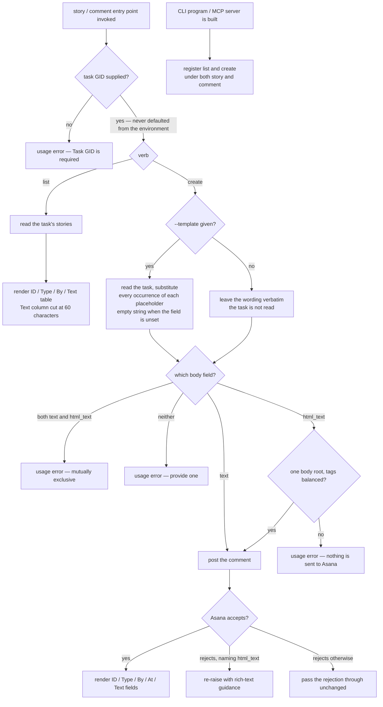

# stories — the comment thread on a task

## What

A **story** is Asana's word for anything that appears in a task's activity feed: a comment somebody
wrote, or a record that a field changed. `stories` is the capability that lets an operator or an
agent **read a task's thread** and **add a comment to it**.

This is the one place in cyber-asana where an agent writes prose that a human will read. Two things
follow from that, and they are what this node actually decides.

First, **rich text is a trap in Asana**. Asana accepts a comment either as plain `text` or as
`html_text`, and `html_text` is not general HTML — it must be one `<body>…</body>` element with
tags that close in order. Asana's own rejection for a malformed payload is terse. So this node
checks the shape **before** sending, and when Asana rejects anyway it re-raises the failure with
guidance saying what the payload should have looked like.

Second, **the comment an agent wants to write usually quotes the task**. Rather than making the
caller fetch the task first, `create` accepts a `--template` flag: the text may contain
`{task.name}`, `{task.assignee}`, `{task.due_on}` and `{task.notes}`, and the command reads the
task and substitutes them before posting.

The word "story" is Asana's; almost everyone who uses this says "comment". So every entry point is
registered twice, once under `story` and once under `comment`, running the same code.

**Key terms**

- **Story** — one entry in a task's activity feed: a comment, or a record of a change.
- **GID** — Asana's global id for any object; an opaque string, never parsed.
- **`html_text`** — Asana's rich-text form for a comment: a single `<body>…</body>` root with
  balanced tags. Not general HTML.
- **Template** — comment text containing `{task.…}` placeholders that are substituted from the task
  before the comment is posted.

**Non-goals.** This node wraps **reading a task's thread** and **appending to it** — nothing else.
Asana's stories API also exposes reading one story by its own GID, editing a story, and deleting a
story; none is wrapped. Nor does this node filter the thread down to comments only: a `list` returns
the activity records alongside the comments, exactly as Asana returns them, and the `Type` column is
what tells them apart.
That cut matches the shape of the operation. Asana restricts both writes — a story's text is
editable only for comment stories, and a user may delete only stories they created themselves — so a
general `story update` or `story delete` would be a surface that fails for most rows a `list`
returns. Asana's own MCP server draws the same line, exposing a comment-adding tool and no story
read, edit, or delete.

**What this node does not own.** How a paginated list behaves, the `--json` / `--toon` output
formats, empty-state rendering, and exit-code conventions are the shared contract in
[axi](../axi/README.md), adopted here rather than re-decided. The `--task-gid` / legacy `--task`
flag pairing is likewise the shared GID-option convention; this node's decision is only that the
task GID is **required** and is never defaulted from the environment.

## Use Cases

**Subject** — reading a task's comment thread and appending a comment to it, over the two surfaces
(CLI and MCP) that share one `api.ts`, each surface exposed under both a `story` and a `comment`
name.

| Entry point | Trigger | Inputs | Outcome |
|---|---|---|---|
| `story list` (CLI) | operator or agent wants to read a task's thread | `--task-gid <gid>` plus pagination options | the task's stories, rendered as an ID/Type/By/Text table in text mode |
| `asana_story_list` (MCP) | agent wants the same thread over MCP | `task_gid` plus the shared pagination params | the same result, JSON-serialized |
| `story create` (CLI) | operator or agent wants to comment on a task | `--task-gid <gid>`, the comment as a positional argument or `--html-text <html>`, optionally `--template` | the created story, rendered as ID/Type/By/At/Text fields in text mode |
| `asana_story_create` (MCP) | agent wants to comment over MCP | `task_gid`, `text` or `html_text`, optional `template` | the created story, JSON-serialized |
| `comment list` / `comment create` (CLI aliases) | caller reaches for the everyday word instead of Asana's | identical to the `story` forms | identical behavior |
| `asana_comment_list` / `asana_comment_create` (MCP aliases) | same, over MCP | identical to the `asana_story_*` forms | identical behavior |

Both surfaces route through `api.ts`; neither `cli.ts` nor `mcp.ts` calls the Asana SDK directly.

## Logic

The load-bearing edges:

- **`task GID supplied?`** is shared by both verbs, so the map covers it once — the outcome of the
  guard does not depend on which verb was asked for. Its `no` branch is a usage error rather than a
  fallback: unlike a *scoping* workspace GID, the task GID names the **subject** being read or
  written, and commenting on a different task than the one named would be worse than an error.
- **`--template given?`** decides whether the task is read at all. Without the flag, `{task.…}` is
  ordinary text and no extra request is made — which is what makes it safe to post a comment that
  literally discusses the template syntax.
- **`one body root, tags balanced?`** is checked locally, so a malformed rich-text payload costs no
  request. Attributes and self-closing tags pass; an unclosed or out-of-order tag does not.
- **`Asana accepts?`** splits on whether the rejection names `html_text`. Only that case is
  re-raised with rich-text guidance; every other failure is passed through untouched, so a
  not-found or permission failure is not mislabeled as a formatting problem.
- The **alias** root is a construction-time decision, not a runtime one: it shares no decision with
  the rest of the graph, which is why it hangs off its own root.

## Scenario map

### task scoping (shared by `list` and `create`)

| Edge | Path (Given) | Scenario |
|---|---|---|
| task GID supplied → proceed | a GID naming a task that carries stories | `list reads the stories of the task GID it was given` |
| task GID absent → usage error | an invocation carrying no task GID | `an entry point without a task GID is a usage error` |
| environment never supplies the task GID (barred) | `ASANA_WORKSPACE` set, no task GID given | `an entry point does not default the task GID from the environment` |

### `story list` / `asana_story_list`

| Edge | Path (Given) | Scenario |
|---|---|---|
| render ID / Type / By / Text table | text mode, a comment and an activity record on one task | `list renders each story's id, type, author and text in text mode` |
| Text column cut at 60 characters | text mode, a story whose text runs past 60 characters | `list cuts a long story's text at sixty characters in the table` |

### `story create` / `asana_story_create`

| Edge | Path (Given) | Scenario |
|---|---|---|
| text → post the comment | plain wording supplied as the positional argument | `create posts the positional text as a comment on the task` |
| html_text → post the comment | rich text that is one body root with balanced tags | `create posts html_text unchanged when the rich-text flag is given` |
| body-root check fails → nothing sent | rich text whose outermost element is not `<body>` | `create rejects html_text that has no body root` |
| tag-balance check fails → nothing sent | rich text with an opened tag that never closes | `create rejects html_text whose tags are unbalanced` |
| tag-balance check passes | rich text carrying a self-closing tag and an attribute | `create accepts html_text with self-closing and attributed tags` |
| both fields → usage error | plain wording and rich text supplied together | `create with both text and html_text is a usage error` |
| neither field → usage error | an invocation supplying only the task GID | `create with neither text nor html_text is a usage error` |
| template → substitute into text | the template flag with placeholders in the plain wording | `create substitutes task fields into the text under the template flag` |
| template → substitute into html_text | the template flag with placeholders inside the rich text | `create substitutes task fields into html_text under the template flag` |
| template → every occurrence substituted | one placeholder written twice in the wording | `create substitutes every occurrence of a repeated placeholder` |
| template → empty string for an unset field | a task whose assignee is unset | `create substitutes an empty string for a task field that is unset` |
| no template → verbatim, task not read | placeholder syntax present, the template flag absent | `create leaves placeholder syntax untouched without the template flag` |
| Asana rejects naming html_text → guidance | Asana answers the create call with an error mentioning html_text | `create adds rich-text guidance to an Asana rejection that names html_text` |
| Asana rejects otherwise → pass through | Asana answers the create call with a not-found error | `create passes through an Asana rejection that does not name html_text` |
| render ID / Type / By / At / Text fields | text mode, a story Asana accepted | `create renders the new story's fields in text mode` |

### `comment` aliases

| Edge | Path (Given) | Scenario |
|---|---|---|
| register under both names (CLI) | the built CLI program | `the comment command group exposes the same list and create subcommands as story` |
| register under both names (MCP) | the built MCP server | `the MCP server registers list and create tools under both the story and comment names` |
| alias runs the same operation | a comment posted through the alias | `a comment posted through the comment alias reaches the same stories endpoint` |

## References

- Asana API — [Stories](https://developers.asana.com/reference/stories) backs the claim that reading
  one story by GID, updating a story, and deleting a story are the remaining operations this node
  leaves unwrapped, and that a comment is posted as either `text` or `html_text`.

## Known bugs

**The `Text` column's 60-character cut should go through the shared `truncate()` helper and does
not.** The cut was written before `src/truncate.ts` existed and was never migrated to it, so the
column ignores the global `--full` flag and emits no size hint — the one free-text column in the
package that does neither, against the rule in AGENTS.md.

**A locally-detected `html_text` shape failure is reported as though Asana rejected it.** The
pre-send shape check runs inside the same `try` that wraps the Asana call, and the rewrap keys off
nothing more than the substring `html_text` in the message, so a payload rejected before any request
is made comes back under the wording `Asana rejected html_text`. The guidance attached to the error
is correct; the attribution is not.
