# tags — the cross-cutting labels put on tasks

## What

An Asana **tag** is a small coloured label — "Urgent", "Needs design", "Q3" — that can be stuck on
any task in a workspace. Projects and sections group tasks into one place; a tag cuts *across* those
places. The same tag can sit on tasks in ten different projects, which is exactly why people reach
for one: to answer "show me everything anywhere that is blocked".

Two facts about tags shape everything in this node.

**A tag lives in a workspace.** There is no global tag. So every operation that brings a tag into
existence, or asks which tags exist, needs a workspace to work in.

**A tag is a relationship, not a property.** Sticking a tag on a task does not edit the tag and does
not edit the task's own fields; it creates a link between the two. That link can be read from either
end — *what tags are on this task?* and *what tasks carry this tag?* — and both directions are
offered here, because a caller who has a task GID and a caller who has a tag GID are asking
genuinely different questions.

So this node covers three things: finding and reading tags, the tag's own life (create, rename,
recolour, delete), and the link between a tag and a task.

**Key terms**

- **GID** — Asana's global id for any object; an opaque string, never parsed and never arithmetic.
- **Tag** — a named, optionally coloured label belonging to one workspace, carrying a name, a GID,
  an optional colour and optional notes.
- **Workspace** — the top-level Asana container a tag belongs to. See
  [workspaces](../workspaces/README.md).
- **Association** — the link between one tag and one task. Adding or removing it changes neither
  record's own fields; it changes what connects them.
- **Colour** — an optional presentation field on a tag. Asana leaves it unset on plenty of tags, so
  this node treats a missing colour as ordinary rather than exceptional.

**Non-goals.** This node does not offer a **global tag listing**. Asana's API can return tags
without a workspace, and that call is deliberately not wrapped: a workspace-less list of labels is
an answer no caller of this package can act on, since every subsequent operation needs the workspace
anyway. Likewise the **workspace-in-the-body** form of tag creation is not wrapped — one create
path, with the workspace named as a scope, is enough, and two spellings of the same operation is a
choice the caller should not have to make. There is **no bulk association**: one call links one tag
to one task, never a list of either. And a tag can be attached here to a **task and nothing else**,
which is not a restriction this node invented — in Asana that is the only thing a tag attaches to.
Finally, this node does not search or filter tags by name; it lists them and hands back GIDs.

**The CLI groups the four association verbs under `tag task`; MCP spells them flat.** That split is
deliberate and is not this node's invention. One day earlier the tasks node converted its own flat
`subtask-list` / `subtask-create` pair into a nested group, explicitly to make the relationship
discoverable under `--help` and to leave room for further actions; `tag task` follows that
convention, as `task follower`, `task project`, and `task dependency` do. MCP stays flat because tool
names are a namespace rather than a menu, and agents do not browse them.

**What this node does not own.** Paginated list behavior — bare array versus envelope, what `--all`
walks, where `--max-pages` stops, how `next_page` and `truncated` are reported — is the shared list
contract in [axi](../axi/README.md), adopted here rather than re-decided. Likewise the `--json` /
`--toon` formats, empty-state rendering, truncation, exit-code conventions, and the normalized-GID
flag mechanism (`--workspace-gid` with its legacy `--workspace` alias). This node decides which
entry points exist, where each one's GIDs come from, what its text rendering shows, and — for
`delete` alone — one deliberate departure from the shared output contract, recorded below.

## Use Cases

**Subject** — finding, reading, creating, changing and deleting Asana tags, and linking tags to
tasks in both directions, over the two surfaces (CLI and MCP) that share one `api.ts`.

| Entry point | Trigger | Inputs | Outcome |
|---|---|---|---|
| `tag list` (CLI) | caller needs the tags available in a workspace | a workspace GID by flag or from `ASANA_WORKSPACE`, plus pagination options | the workspace's tags, rendered as a Name/ID/Color table in text mode |
| `asana_tag_list` (MCP) | agent needs the same listing over MCP | `workspace_gid` (required) plus the shared pagination params | the same result, JSON-serialized |
| `tag get <gid>` (CLI) | caller holds a tag GID and wants that tag's record | the tag GID, positionally | the unwrapped tag record, rendered as Name/ID/Color fields in text mode |
| `asana_tag_get` (MCP) | same, over MCP | `tag_gid` | the same record, JSON-serialized |
| `tag create <name>` (CLI) | caller wants a new label in a workspace | the tag name positionally, a workspace GID by flag or from `ASANA_WORKSPACE`, optional `--color` and `--notes` | the created tag record, rendered as Name/ID/Color fields |
| `asana_tag_create` (MCP) | same, over MCP | `workspace_gid` and `name` required, `color` and `notes` optional | the created tag record, JSON-serialized |
| `tag update <gid>` (CLI) | caller wants to rename, recolour or re-note an existing tag | the tag GID positionally, plus any of `--name`, `--color`, `--notes` | the updated tag record, rendered as Name/ID/Color fields |
| `asana_tag_update` (MCP) | same, over MCP | `tag_gid` required, `name` / `color` / `notes` optional | the updated tag record, JSON-serialized |
| `tag delete <gid>` (CLI) | caller wants a tag gone from the workspace | the tag GID, positionally | a plain confirmation line naming the deleted GID |
| `asana_tag_delete` (MCP) | same, over MCP | `tag_gid` | a confirmation body naming the deleted GID |
| `tag task list <task-gid>` (CLI) | caller holds a task and wants its labels | the task GID positionally, plus pagination options | the task's tags, rendered as a Name/ID/Color table |
| `asana_tag_list_for_task` (MCP) | same, over MCP | `task_gid` plus the shared pagination params | the same result, JSON-serialized |
| `tag tasks <tag-gid>` (CLI) | caller holds a tag and wants everything carrying it | the tag GID positionally, plus pagination options | the tag's tasks, rendered as a Name/ID/Done/Due table |
| `asana_tag_list_tasks` (MCP) | same, over MCP | `tag_gid` plus the shared pagination params | the same result, JSON-serialized |
| `tag task add <task-gid> <tag-gid>` (CLI) | caller wants a label put on a task | both GIDs, positionally, task first | a confirmation naming both GIDs and the status `added` |
| `asana_tag_add_to_task` (MCP) | same, over MCP | `task_gid` and `tag_gid` | Asana's response record, JSON-serialized |
| `tag task remove <task-gid> <tag-gid>` (CLI) | caller wants a label taken off a task | both GIDs, positionally, task first | a confirmation naming both GIDs and the status `removed` |
| `asana_tag_remove_from_task` (MCP) | same, over MCP | `task_gid` and `tag_gid` | Asana's response record, JSON-serialized |

Nine operations, offered whole on both surfaces. The CLI spells four of them under a `tag task`
sub-group; MCP has a flat tool namespace and spells the same four as four tools. `tag task` itself
carries no action, which is why the CLI shows one more *command* than MCP shows tools while offering
no operation MCP lacks.

## Logic

```mermaid
graph TD
  subgraph discovery["tag list / tag get and their MCP tools"]
    L[list invoked] --> LF{workspace GID given as a flag or param?}
    LF -->|yes| LQ[list tags of that workspace]
    LF -->|no, CLI| LE{ASANA_WORKSPACE set?}
    LE -->|yes| LQ
    LE -->|no| LU[usage error — Workspace GID is required]
    LQ --> LT[render Name / ID / Color table —<br/>a colourless tag gets an empty Color cell]

    G[get invoked] --> GF[fetch tag by GID alone,<br/>no workspace scope sent]
    GF --> GC{record carries a colour?}
    GC -->|yes| GR[render Name / ID / Color fields]
    GC -->|no| GN[render Name / ID only —<br/>the Color line is dropped]
  end

  subgraph lifecycle["tag create / update / delete and their MCP tools"]
    C[create invoked with a name] --> CF{workspace GID given as a flag or param?}
    CF -->|no, CLI| CE{ASANA_WORKSPACE set?}
    CE -->|no| CU[usage error — Workspace GID is required]
    CE -->|yes| CB
    CF -->|yes| CB[build the request body]
    CB --> CO{colour or notes supplied?}
    CO -->|supplied| CS[body carries name plus those fields]
    CO -->|absent| CN[body carries the name only —<br/>absent flags are not sent as empty values]

    U[update invoked with a tag GID] --> UO[collect only the field flags actually given]
    UO --> UN{any field given?}
    UN -->|yes| UP[send that change set]
    UN -->|no| UZ[send an empty change set —<br/>no at-least-one-field guard]

    D[delete invoked with a tag GID] --> DD[delete the tag]
    DD --> DC{which surface?}
    DC -->|CLI| DL[print a confirmation line —<br/>written directly, not through the format layer]
    DC -->|MCP| DJ[return a confirmation body naming the deleted GID]
  end

  subgraph association["tag task list / tag tasks / tag task add / tag task remove"]
    A[association entry point invoked] --> AD{which direction?}
    AD -->|tags of a task| AT[list tags for that task GID]
    AD -->|tasks of a tag| AS[list tasks for that tag GID]
    AT --> ATR[render Name / ID / Color table]
    AS --> ASR[render Name / ID / Done / Due table —<br/>Done reads yes or no]
    AD -->|link| AA[send the tag GID in the body,<br/>the task GID in the path]
    AD -->|unlink| AR[send the tag GID in the body,<br/>the task GID in the path]
    AA --> AC[confirm with both GIDs and a status word]
    AR --> AC
  end
```

The load-bearing edges:

- **Only the workspace-scoped entry points read the environment.** `list` and `create` fall back to
  `ASANA_WORKSPACE` when no flag is given; `get`, `update` and `delete` never do, because a tag GID
  already identifies the tag and accepting a scope that is never sent would be a lie. This is the
  same split [teams](../teams/README.md) makes, and for the same reason.
- **Absent optional fields are absent from the request.** `create` and `update` build their bodies
  from the flags actually given. A flag the caller did not type is not sent as an empty value, so
  `tag update <gid> --color blue` recolours without blanking the notes.
- **`update` has no at-least-one-field guard.** Invoked with no field flags at all, it still calls
  Asana with an empty change set. That is recorded here as the contract, not as an accident to be
  worked around by callers.

  No entry point in this package guards against an empty change set, so tags is not an exception to
  a rule — it is the rule. Asana's contract makes the call safe: only the fields present in the
  `data` block are written, everything else is left alone, and the complete record comes back. A
  guard here would reject a request Asana answers correctly.

- **`delete` is the one entry point that bypasses the shared output layer.** Asana returns nothing
  useful from a delete, so the CLI writes its own confirmation line naming the GID. The consequence
  is real and is frozen deliberately: the structured-format flags do not change what `delete` prints.
  MCP, which has no prose channel, answers with a small confirmation body instead.
- **Both association directions exist because both questions are asked.** The tags-of-a-task read
  and the tasks-of-a-tag read hit different Asana endpoints and render different columns; neither is
  derivable from the other without walking a whole workspace.
- **Add and remove confirm with the two GIDs, not with what Asana returned.** Asana answers an
  association change with a task-shaped record, which tells the caller nothing about the change they
  just made. The confirmation names the task, the tag, and which way the link moved.

## Scenario map

### `tag list` / `asana_tag_list`, `tag get` / `asana_tag_get`

| Edge | Path (Given) | Scenario |
|---|---|---|
| workspace GID given → list that workspace | a workspace holding two tags | `list returns the tags of the workspace it was given` |
| no flag → environment fallback | `ASANA_WORKSPACE` set, no flag passed | `list falls back to the workspace environment variable` |
| no flag, no environment → usage error | a shell whose only Asana variable is the token | `list without a workspace GID anywhere is a usage error` |
| colour column rendering | text mode, one coloured tag and one colourless tag | `list leaves the colour cell empty for a tag that has no colour` |
| tag GID alone identifies the tag | `ASANA_WORKSPACE` set and a tag GID given | `get requests the tag by GID and sends no workspace scope` |
| record carries a colour → render it | text mode, a tag whose record carries a colour | `get renders the tag's name, GID and colour in text mode` |
| record omits the colour → drop the line | text mode, a tag whose record omits the colour | `get omits the colour line when the tag record carries no colour` |
| tag GID absent → usage error | no positional argument on the get command | `get without a tag GID is a usage error` |

### `tag create` / `tag update` / `tag delete` and their MCP tools

| Edge | Path (Given) | Scenario |
|---|---|---|
| name plus optional fields → create with all of them | a workspace, with a colour and notes supplied alongside the name | `create sends the name, colour and notes it was given` |
| optional fields absent → body carries the name only | a workspace and a name, with neither optional flag typed | `create sends only the name when no colour or notes flag is typed` |
| no flag → environment fallback | `ASANA_WORKSPACE` set, no workspace flag passed | `create falls back to the workspace environment variable` |
| no flag, no environment → the write never leaves | a shell whose only Asana variable is the token, with a tag name already typed | `create without a workspace GID anywhere is a usage error` |
| some field flags given → send exactly those | a tag GID and a single field flag | `update sends only the field whose flag was given` |
| no field flags given → empty change set, no guard | a tag GID and no field flags | `update with no field flags still calls Asana with an empty change set` |
| tag GID absent → usage error | no positional argument on the update command | `update without a tag GID is a usage error` |
| CLI delete confirms outside the format layer | a tag GID and the structured JSON flag | `delete prints the same confirmation line whatever output format is asked for` |
| tag GID absent → usage error | no positional argument on the delete command | `delete without a tag GID is a usage error` |
| MCP delete answers with a confirmation body | the registered MCP delete tool and a tag GID | `asana_tag_delete answers with a body naming the deleted tag GID` |

### `tag task list`, `tag tasks`, `tag task add`, `tag task remove` and their MCP tools

| Edge | Path (Given) | Scenario |
|---|---|---|
| direction is tags-of-a-task | a task carrying two tags | `task list returns the tags on the task GID it was given` |
| direction is tasks-of-a-tag | a tag carried by a finished task and an unfinished one | `tasks returns the tasks carrying the tag GID it was given` |
| link → send tag in body, task in path, confirm both | a task and a tag not yet linked | `task add links the tag to the task and confirms both GIDs` |
| unlink → send tag in body, task in path, confirm both | a task already carrying the tag | `task remove unlinks the tag from the task and confirms both GIDs` |
| second positional GID absent → usage error | a task GID typed with no tag GID after it | `task add with only one GID is a usage error` |
| second positional GID absent on the unlink → usage error | a task already carrying the tag, its GID typed with no tag GID after it | `task remove with only one GID is a usage error` |
| task GID absent → usage error | no positional argument on the task list command | `task list without a task GID is a usage error` |
| tag GID absent → usage error | no positional argument on the tasks command | `tasks without a tag GID is a usage error` |

### surface shape

| Edge | Path (Given) | Scenario |
|---|---|---|
| every operation reaches both surfaces | the registered tag tool set | `every tag operation the CLI offers has an MCP tool` |
| the CLI sub-group is a container, not an operation (barred) | the registered tag tool set and the tag command group | `the tag task grouping is a CLI container with no tool of its own` |

## References

- Asana API — [Tags](https://developers.asana.com/reference/tags) backs two claims: that a tag
  belongs to a workspace and attaches only to tasks, and that a workspace-less tag listing plus a
  workspace-in-the-body create are the remaining tag operations this node leaves unwrapped.
