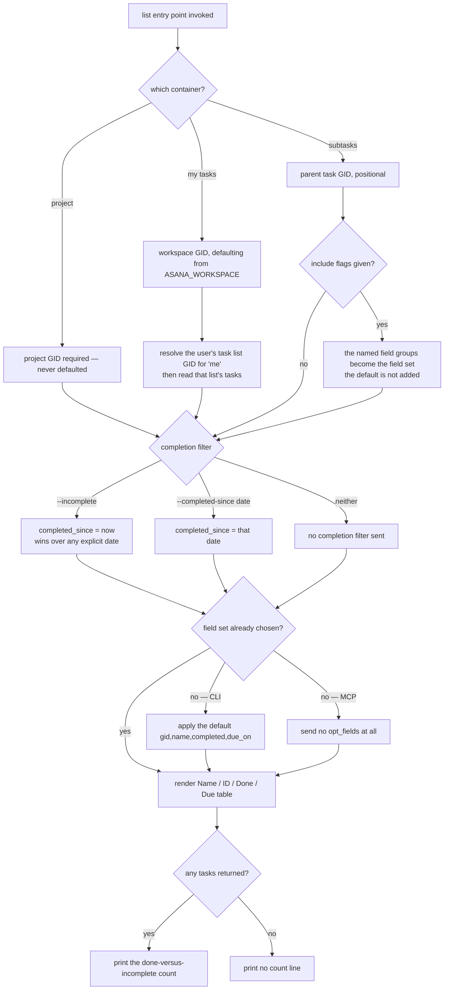
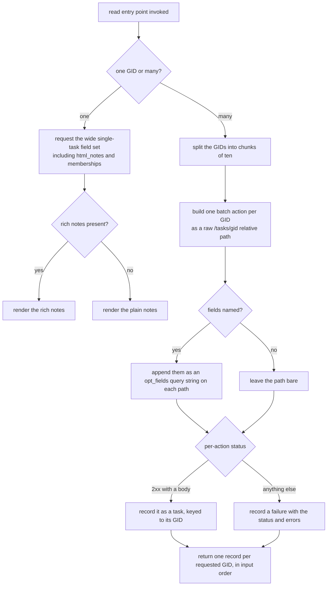
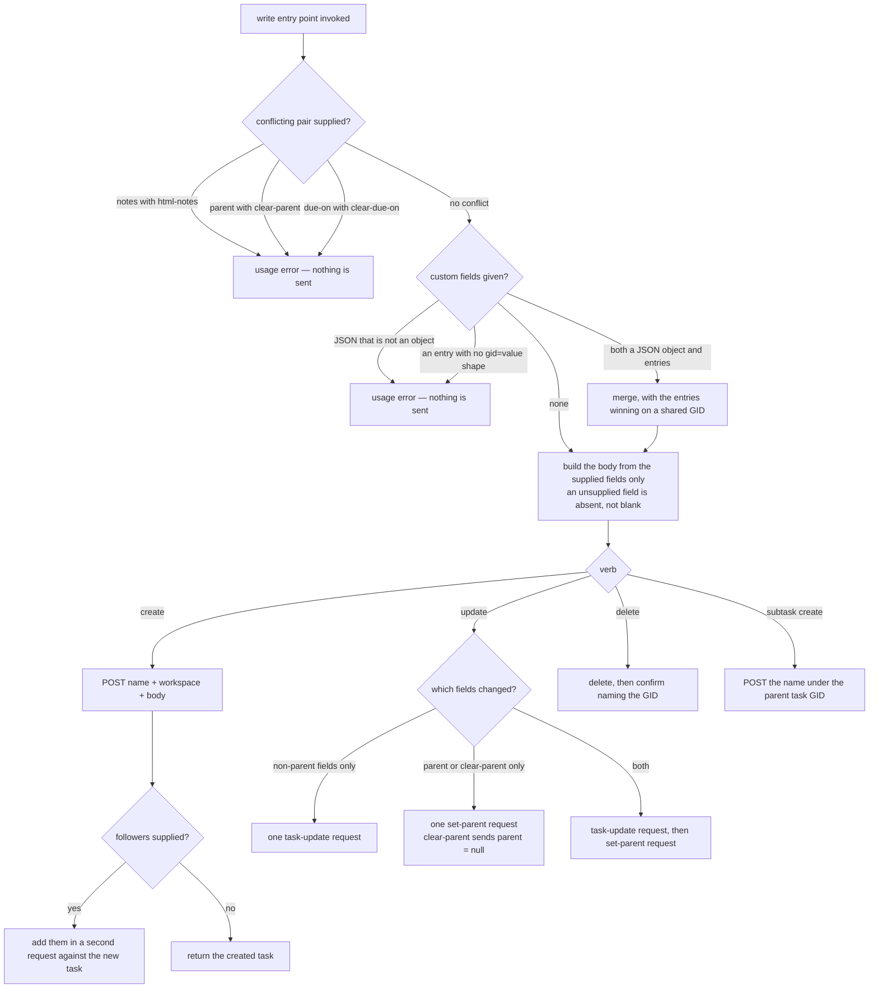
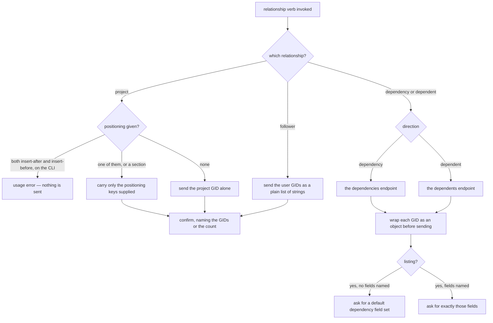
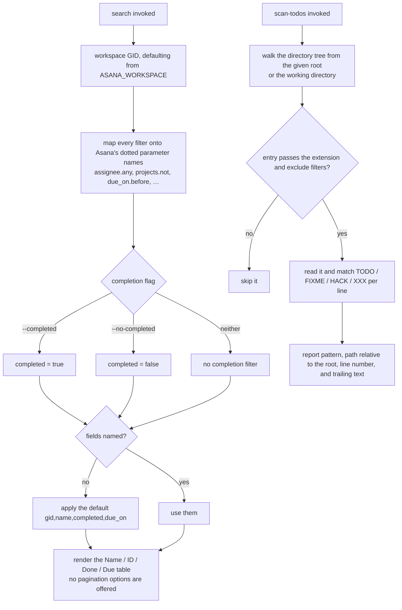

# tasks — the unit of work, and everything hung off it

## What

A **task** is the thing Asana is actually about: a named piece of work with an owner, a due date, a
completion flag, and a place in one or more projects. `tasks` is the largest capability in
`cyber-asana` because almost every other domain exists to describe something *attached* to a task.
This node owns the task record itself — finding tasks, reading them, writing them, and wiring them
to each other.

The problem it solves is that an agent working through Asana spends nearly all its calls here, and
Asana's task endpoints are both wide and inconsistent. A single task record carries dozens of
fields; a list of two hundred tasks carrying all of them will exhaust an agent's context before it
reads the first name. Different task relationships live behind differently-shaped endpoints — some
take a plain list of GIDs, some take a list of objects, one takes a GID that must be looked up
first. This node's job is to make one coherent surface out of that: **narrow by default when
reading many, wide when reading one, and never make the caller learn Asana's payload shapes.**

Three decisions carry most of the node's weight.

**Lists ask for four fields; a single read asks for everything.** Every list entry point sets a
default field set — `gid,name,completed,due_on`, exactly the four columns the table renders — when
the caller names none. `tasks` is the **only** domain in the package that does this. Reading *one*
task goes the other way and asks for a deliberately wide field set, including the rich-text notes,
because a caller who named a single GID wants the whole thing.

**Reading many tasks by GID is one round trip, and a failure is per-GID.** `get-many` does not loop
over single reads. It packs up to ten task reads into one Asana batch request, and returns one
record per requested GID **in the order asked for**, each marked as either a task or a failure with
its own status code. One bad GID in a list of nine does not lose the other eight.

**A write sends what you supplied and nothing else.** Every write body is built **by omission**: a
field the caller did not name is absent from the request, not present-and-empty. Clearing a value is
therefore its own explicit input (`--clear-due-on`, `--clear-parent`) rather than "pass an empty
string", and naming both a value and its clear flag is a usage error caught locally, before anything
leaves the process.

**Key terms**

- **GID** — Asana's global id for any object; an opaque string, never parsed.
- **Task** — one named unit of work. May be a **subtask**, meaning it has a parent task.
- **`opt_fields`** — the comma-separated list telling Asana which fields to include in a response.
  Small for lists, wide for a single read.
- **Batch request** — one Asana call carrying several sub-requests, each with its own status code.
- **Dependency / dependent** — a *dependency* is a task this task waits on; a *dependent* is a task
  that waits on this one. Two directions, four verbs, two different endpoints.
- **My Tasks** — the authenticated user's personal task list in a workspace. Not a project; it has
  its own GID that must be resolved before its tasks can be read.
- **Follower** — a user subscribed to a task's notifications. Not the assignee.

**Non-goals.** This node does not resolve names to GIDs. A caller holding "the rollout task" and no
GID searches for it first; nothing here accepts a task *name* where a GID is expected, and no entry
point guesses. It does not model workflow state beyond Asana's own `completed` boolean — there is no
"in progress", no status column, no burndown. It does not batch *writes*: the batch endpoint is used
for reads only, so a bulk update is the caller's loop, deliberately, because a half-applied bulk
write is far worse than a slow one. And `scan-todos`, which reads source files on disk for
TODO/FIXME markers, contacts Asana not at all — it produces the raw material for tasks, and stops
there.

**What this node does not own.** The paginated list envelope, `--json` / `--toon`, empty-state
rendering, truncation mechanics and `--full`, exit codes, and the normalized `--x-gid` flag with its
legacy alias are the shared contract in [axi](../axi/README.md), adopted here rather than
re-decided. Everything *attached* to a task belongs to its own node: comments are
[stories](../stories/README.md), files are [attachments](../attachments/README.md), the project a
task lives in is [projects](../projects/README.md), the section it sits in is
[sections](../sections/README.md), and its labels are [tags](../tags/README.md). This node owns only
the task record and the relationships whose endpoints hang off `/tasks`.

## Use Cases

**Subject** — finding, reading, writing, and relating Asana tasks, over the two surfaces (CLI and
MCP) that share one `api.ts`. Neither `cli.ts` nor `mcp.ts` calls the Asana SDK directly.

### Listing tasks in a container

| Entry point | Trigger | Inputs | Outcome |
|---|---|---|---|
| `task list` (CLI) | caller wants a project's tasks | `--project-gid`, `--completed-since` or `--incomplete`, pagination options | the project's tasks as a Name/ID/Done/Due table, with a done-versus-incomplete count |
| `asana_task_list` (MCP) | agent wants the same | `project_gid`, `completed_since`, `incomplete`, pagination params | the same result, JSON-serialized, with no default field set applied |
| `task my-tasks list` (CLI) | caller wants their own task list in a workspace | `--workspace-gid` (defaults from `ASANA_WORKSPACE`), `--incomplete`, pagination | the authenticated user's tasks, same table |
| `asana_task_my_tasks` (MCP) | agent wants the same | `workspace_gid`, `completed_since`, `incomplete`, pagination params | the same result, JSON-serialized |
| `task subtask list <task-gid>` (CLI) | caller wants a task's children | the parent GID, `--incomplete`, the include flags `--assignee-email` / `--follower-emails` / `--num-subtasks` / `--custom-fields`, pagination | the subtasks, same table |
| `asana_task_subtask_list` (MCP) | agent wants the same | `task_gid`, `incomplete`, the same four include booleans, pagination params | the same result, JSON-serialized |

### Reading tasks by GID

| Entry point | Trigger | Inputs | Outcome |
|---|---|---|---|
| `task get <gid>` (CLI) | caller holds one GID and wants the whole task | the task GID, positionally | the task rendered as Name/ID/URL/Assignee/Due/Done/Notes fields |
| `asana_task_get` (MCP) | agent wants the same | `task_gid` | the same record, JSON-serialized, including `html_notes` |
| `task get-many <gids...>` (CLI) | caller holds several GIDs and wants them in one trip | the GIDs, positionally, plus `--opt-fields` | one record per GID in order, each a task or a status-and-errors block |
| `asana_task_get_many` (MCP) | agent wants the same | `task_gids` array, `opt_fields` | the same array, JSON-serialized |

### Creating, updating, and deleting a task

| Entry point | Trigger | Inputs | Outcome |
|---|---|---|---|
| `task create <name>` (CLI) | caller wants a new task | `--workspace-gid` (defaults from env), `--project-gid`, `--parent-gid`, `--assignee-gid`, `--notes` or `--html-notes`, `--due-on`, `--resource-subtype`, `--follower`, `--custom-fields-json`, repeated `--custom-field <gid=value>` | the created task, rendered as fields |
| `asana_task_create` (MCP) | agent wants the same | `workspace_gid`, `name`, `project_gid` or `project_gids`, `follower_gids`, `assignee_gid`, `notes` or `html_notes`, `due_on`, `parent_gid`, `resource_subtype`, `custom_fields` object | the created task, JSON-serialized |
| `task update <gid>` (CLI) | caller wants to change a task | the GID plus `--name`, `--notes` / `--html-notes`, `--completed`, `--due-on` / `--clear-due-on`, `--parent-gid` / `--clear-parent`, `--resource-subtype`, custom-field options | the updated task, rendered as fields |
| `asana_task_update` (MCP) | agent wants the same | `task_gid` plus the same fields under snake_case names | the updated task, JSON-serialized |
| `task subtask create <task-gid> <name>` (CLI) | caller wants a child task | the parent GID, the name, `--notes`, `--due-on`, `--assignee-gid` | the created subtask, rendered as fields |
| `asana_task_subtask_create` (MCP) | agent wants the same | `task_gid`, `name`, `notes`, `due_on`, `assignee_gid` | the created subtask, JSON-serialized |
| `task delete <gid>` (CLI) | caller wants a task gone | the GID, positionally | a confirmation naming the deleted GID |
| `asana_task_delete` (MCP) | agent wants the same | `task_gid` | the same confirmation as text |

### Project membership and position

| Entry point | Trigger | Inputs | Outcome |
|---|---|---|---|
| `task project add <task-gid> <project-gid>` (CLI) | caller wants a task filed into a project, possibly at a spot | the two GIDs plus `--section-gid`, `--insert-after`, `--insert-before` | a confirmation naming both GIDs |
| `asana_task_project_add` (MCP) | agent wants the same | `task_gid`, `project_gid`, `section_gid`, `insert_after`, `insert_before` | the same confirmation as text |
| `task project remove <task-gid> <project-gid>` (CLI) | caller wants a task out of a project | the two GIDs | a confirmation naming both GIDs |
| `asana_task_project_remove` (MCP) | agent wants the same | `task_gid`, `project_gid` | the same confirmation as text |

### Followers

| Entry point | Trigger | Inputs | Outcome |
|---|---|---|---|
| `task follower add <task-gid> <follower-gids...>` (CLI) | caller wants users subscribed to a task | the task GID and one or more user GIDs | a confirmation naming how many were added |
| `asana_task_follower_add` (MCP) | agent wants the same | `task_gid`, `follower_gids` array | the same confirmation as text |
| `task follower remove <task-gid> <follower-gids...>` (CLI) | caller wants users unsubscribed | the task GID and one or more user GIDs | a confirmation naming how many were removed |
| `asana_task_follower_remove` (MCP) | agent wants the same | `task_gid`, `follower_gids` array | the same confirmation as text |

### Dependencies and dependents

| Entry point | Trigger | Inputs | Outcome |
|---|---|---|---|
| `task dependency list <task-gid>` (CLI) | caller wants what a task waits on | the task GID, `--opt-fields` | the blocking tasks as a Name/ID/Done/Due table |
| `asana_task_dependency_list` (MCP) | agent wants the same | `task_gid`, `opt_fields` | the same array, JSON-serialized |
| `task dependency add` / `remove <task-gid> <dep-gids...>` (CLI) | caller wants to wire or unwire what a task waits on | the task GID and one or more task GIDs | a confirmation naming the count |
| `asana_task_dependency_add` / `_remove` (MCP) | agent wants the same | `task_gid`, `dependency_gids` array | the same confirmation as text |
| `task dependent list <task-gid>` (CLI) | caller wants what waits on a task | the task GID, `--opt-fields` | the blocked tasks as a table |
| `asana_task_dependent_list` (MCP) | agent wants the same | `task_gid`, `opt_fields` | the same array, JSON-serialized |
| `task dependent add` / `remove <task-gid> <dep-gids...>` (CLI) | caller wants to wire or unwire what waits on a task | the task GID and one or more task GIDs | a confirmation naming the count |
| `asana_task_dependent_add` / `_remove` (MCP) | agent wants the same | `task_gid`, `dependent_gids` array | the same confirmation as text |

### Searching a workspace

| Entry point | Trigger | Inputs | Outcome |
|---|---|---|---|
| `task search [text]` (CLI) | caller wants tasks matching a query across a workspace | optional free text, `--workspace-gid` (defaults from env), and the filter options covering assignee / project / section / tag / team / portfolio / follower / creator membership, six date families, completion, subtask, attachment and blocking flags, plus `--sort-by`, `--sort-asc`, `--opt-fields` | matching tasks as a Name/ID/Done/Due table |
| `asana_task_search` (MCP) | agent wants the same | `workspace_gid`, `text`, and the same filters under snake_case names | the same array, JSON-serialized |

### Scanning source for TODO markers

| Entry point | Trigger | Inputs | Outcome |
|---|---|---|---|
| `task scan-todos [dir]` (CLI) | caller wants the TODO/FIXME/HACK/XXX markers in a tree, as candidate tasks | an optional directory (defaults to the working directory), `--ext`, `--exclude` | a File/Line/Pattern/Text table of every marker found |
| `asana_task_scan_todos` (MCP) | agent wants the same | `dir`, `extensions`, `exclude` | the same array, JSON-serialized |

## Logic

Each intent group runs its own decision graph. They share only the surface split (CLI and MCP both
call `api.ts`) and the shared axi contract, which is not redrawn here.

### Listing tasks in a container

The load-bearing edges:

- **`LD` is this node's signature decision.** The four-field default exists because a task list is
  the single most common agent call in the package and Asana's own default payload is an order of
  magnitude wider. The default is applied only when the caller named nothing, so `--opt-fields` is a
  replacement and never a merge — a caller who asks for three fields gets three.
- **`LD`'s CLI and MCP branches deliberately differ.** Only the CLI applies the default; the MCP
  tools forward whatever `opt_fields` they were given, including none. A tool caller composes its
  own field set and a surprise default would silently drop fields it expected.
- **`LF` short-circuits the default.** A subtask include flag such as `--assignee-email` contributes
  its own field group, and once any field is present the default is not added — so asking for
  assignee emails narrows the response to exactly the assignee fields. That is a real consequence of
  the ordering, and the suite pins it.
  <!-- open: whether the include flags suppressing the four-field default (rather than adding to it)
       was deliberate or a side effect of applying the default after the flags — unresolved from
       source and history alone. -->
- **`LCM2` is why My Tasks is not just another list.** Asana addresses a personal task list by its
  own GID, which is not the user GID and not the workspace GID, so the read costs two calls: resolve
  the list for `me` in that workspace, then read it.
- **`LS` guards the aggregate.** An empty result prints no count, because "0 tasks: 0 incomplete, 0
  done" is noise on top of the empty state axi already prints.

### Reading tasks by GID

The load-bearing edges:

- **`RM` is the whole point of `get-many`.** Nine GIDs is one HTTP call, not nine. The chunk size is
  ten because Asana's batch endpoint accepts at most ten actions; a longer list is split across
  successive batches and the results concatenated, so the caller never sees the seam.
- **`RMP` bypasses the SDK.** The batch endpoint takes a *relative path string*, not a typed method
  call, so this is the one place in the domain that constructs an Asana URL by hand. `opt_fields`
  therefore has to be spliced on as a query string rather than passed as a parameter.
- **`RMS` is the reason `get-many` exists rather than a client-side loop.** A per-action failure is
  data, not an exception: the record carries its own status code and Asana's `errors` array, and the
  surrounding successes are still returned. A caller sweeping a list of possibly-stale GIDs learns
  which ones died without losing the rest.
- **`RO` is the deliberate opposite of the list default.** One GID means one task's worth of
  context, so the read asks for notes, rich notes, assignee, parent, projects, tags, followers,
  memberships and subtask counts in one trip.
- **`ROR` prefers the rich notes.** When a task carries both forms, the rendered Notes field shows
  the rich text, because that is the form that survives round-tripping through an agent.

### Creating, updating, and deleting a task

The load-bearing edges:

- **`WX` is checked locally, so a contradictory invocation costs no request.** All three conflicts
  reconverge on the same outcome — a non-zero exit and nothing on the wire — which is why the suite
  covers them as one scenario spanning the three pairs rather than three near-identical ones.
- **`WB` builds by omission rather than by blanking.** An empty string is a *value* in Asana and
  sending one wipes a field. So the only way to clear something is to say so, which is what
  `--clear-due-on` and `--clear-parent` are for, and why they conflict with the value form at `WX`.
- **`WCM` gives the repeated `--custom-field gid=value` entries precedence over the JSON blob.** The
  blob is the bulk form and the entries are the surgical form; a caller who supplies both is
  overriding, and the override direction is the only one that is useful.
- **`WU` splits update in two because Asana does.** Re-parenting is not a field on the task-update
  endpoint — it is its own set-parent call — so an update touching only the parent issues no
  task-update request at all, and an update touching both issues two requests in a fixed order.
- **`WCF` costs a second request too**, for the same reason: followers are not accepted on the
  create body path this node uses, so they are added to the task once it exists.
  <!-- open: after adding followers, `create` returns the follower-call response rather than the
       created task record. Whether that substitution was intended or incidental is unresolved from
       source and history alone. -->

### Relationships — projects, followers, dependencies

The load-bearing edges:

- **`PD` and `PDW` together are the trap this node hides.** Dependencies and dependents are separate
  endpoints in each direction, and unlike followers — which take a plain array of GID strings — they
  take an array of **objects**. Copying the payload shape from the neighbouring follower verb would
  produce a request Asana rejects, which is exactly what the suite's payload-shape scenarios catch.
- **`PP`'s conflict is enforced on the CLI only.** The MCP tool forwards both positioning values and
  lets Asana arbitrate. The asymmetry is real and pinned as such.
  <!-- open: whether the insert-after/insert-before exclusion being CLI-only was a deliberate
       thin-tool choice or simply not mirrored into mcp.ts — unresolved from source and history
       alone. -->
- **`PDLD` uses its own default field set**, set in the gateway rather than in the CLI, so both
  surfaces get it — unlike the task-list default, which is CLI-only.

### Searching a workspace, and scanning source

The load-bearing edges:

- **`SF` is the whole value of `search`.** Asana's search endpoint spells its filters with dots
  (`assignee.any`, `tags.all`, `modified_at.before`), which no shell flag or JSON-schema key can
  carry directly. The mapping from flat flag names to dotted parameters is this node's, and a filter
  that lands on the wrong parameter name silently returns the wrong tasks rather than failing.
- **`SR` offers no pagination.** The search endpoint is not offset-paginated, so exposing `--limit` /
  `--offset` / `--all` here would advertise an escape that does not exist.
- **`TX` and `TO` never touch Asana.** `scan-todos` is the one entry point in the domain that makes
  no network call at all: it produces candidate work from source, and turning a match into a task is
  a separate, explicit `task create`.

## Scenario map

### Listing tasks in a container

| Edge | Path (Given) | Scenario |
|---|---|---|
| no field set named → apply the four-field default | a project list, a my-tasks list, and a subtask list, none naming fields | `a task list asks Asana for only the four fields the table renders` |
| fields named → the default is not added | a project list naming two fields | `an explicit field list replaces the default task field set` |
| include flag supplies the field set | a subtask list with an assignee-email include flag and no named fields | `a subtask include flag supplies the field set in place of the default` |
| no field set named → send none | the MCP task-list tool called with no field parameter | `the MCP task list tool sends no default field set` |
| completion filter → completed_since now | the incomplete flag given alongside an explicit completed-since date | `the incomplete flag lists only tasks completed since now` |
| container GID required → usage error | a project list with no project GID | `a task list without a project GID is a usage error` |
| container GID defaulted from the environment | a my-tasks list with ASANA_WORKSPACE set and no flag | `my-tasks takes the workspace GID from the environment` |
| my-tasks resolves its list GID first | a workspace whose personal task list has its own GID | `my-tasks resolves the authenticated user's task list before reading tasks` |
| tasks returned → print the aggregate | text mode, three tasks of which one is done | `a task list reports how many of the listed tasks are done` |
| tasks returned → print the aggregate | text mode, a project holding no tasks | `an empty task list reports no done-versus-incomplete count` |

### Reading tasks by GID

| Edge | Path (Given) | Scenario |
|---|---|---|
| one GID → the wide single-task field set | a single-task read by GID | `get asks for the wide single-task field set` |
| rich notes present → render them | a task carrying both plain notes and rich notes | `get shows the rich-text notes in place of the plain notes` |
| many GIDs → one record per GID in input order | three GIDs given in a deliberately unsorted order | `get-many returns one record per requested GID in the order given` |
| more than ten GIDs → successive batches | twelve GIDs in one invocation | `get-many splits more than ten GIDs across separate batch requests` |
| per-action failure → a failure record beside the successes | a batch where one GID answers 404 and the other answers 200 | `get-many reports a per-GID failure alongside the lookups that succeeded` |
| fields named → spliced into each batched path | a batch lookup naming two fields | `get-many carries the requested fields in each batched task path` |

### Creating, updating, and deleting a task

| Edge | Path (Given) | Scenario |
|---|---|---|
| create → name and workspace in the body | a workspace GID and a task name | `create posts the task name under the workspace GID it was given` |
| unsupplied field → absent from the body | a create and an update each naming exactly one optional field | `create and update send only the optional fields that were supplied` |
| conflicting pair → usage error, nothing sent | invocations pairing notes with rich notes, parent with clear-parent, and due-on with clear-due-on | `conflicting write options are rejected before any request reaches Asana` |
| followers supplied → a second request | a create naming two follower GIDs | `create adds followers in a second request after the task exists` |
| custom-field JSON and entries → entries win | a JSON object and a repeated entry naming the same custom field GID | `a repeated custom-field entry overrides the same field from the custom-fields JSON` |
| custom-field input rejected → nothing sent | a custom-fields JSON holding an array, and an entry with no equals sign | `malformed custom-field input is rejected before any request reaches Asana` |
| clear flag → an explicit null | an update naming clear-due-on and nothing else | `clear-due-on sets the due date to null` |
| parent change → its own request | an update naming both a new name and a new parent GID | `update routes a parent change through a separate request from the other fields` |
| parent change → its own request | an update naming clear-parent and nothing else | `clear-parent alone issues only the parent request` |
| delete → confirmation naming the GID | text mode, a task that deletes cleanly | `delete confirms by naming the task it removed` |
| subtask create → posted under the parent | a parent task GID and a subtask name | `subtask create posts the name under the parent task` |

### Project membership and position

| Edge | Path (Given) | Scenario |
|---|---|---|
| no positioning → project GID alone | a task added to a project with no section or position | `project add posts the project GID with no positioning keys when none are given` |
| positioning supplied → carried through | a task added into a named section after a named sibling task | `project add carries the section and the insert-after position` |
| both positions supplied → usage error | a CLI project-add naming insert-after and insert-before together | `project add with both insert-after and insert-before is a usage error` |
| both positions supplied → forwarded | the MCP project-add tool called with both positioning values | `the MCP project-add tool forwards both positioning values without a local guard` |
| project removal → confirmation | text mode, a task removed from a project | `project remove confirms the task left the project` |

### Followers

| Edge | Path (Given) | Scenario |
|---|---|---|
| follower payload is a plain list of strings | two user GIDs added as followers | `follower add sends the user GIDs as a plain list of strings` |
| removal direction → the removal endpoint | two user GIDs removed as followers | `follower remove reaches the follower-removal endpoint and reports the count` |

### Dependencies and dependents

| Edge | Path (Given) | Scenario |
|---|---|---|
| no fields named → the default dependency field set | a dependency list naming no fields | `dependency list asks for a default field set when none is named` |
| dependency payload wraps each GID in an object | two task GIDs added as dependencies | `dependency add wraps each GID in an object in the request body` |
| direction → the matching endpoint | the same task GID driven through all four dependency and dependent verbs | `the dependency and dependent verbs reach the endpoint matching their direction` |
| removal → confirmation naming the count | text mode, two dependencies removed | `dependency remove reports how many dependencies it removed` |

### Searching a workspace

| Edge | Path (Given) | Scenario |
|---|---|---|
| flat filter names → Asana's dotted parameters | a search filtering by assignee, excluded projects, and required tags | `search maps its any, not, and all filters to Asana's dotted parameter names` |
| completion flag → an explicit completion filter | a search given the no-completed flag | `search asks only for incomplete tasks under the no-completed flag` |
| no fields named → the default task field set | a search naming no fields | `search asks for the default task field set when no fields are named` |
| no pagination offered (barred) | the search subcommand's help text | `search offers no pagination options` |

### Scanning source for TODO markers

| Edge | Path (Given) | Scenario |
|---|---|---|
| marker matched → reported with its location | a source file carrying a TODO and a FIXME on known lines | `scan-todos reports the marker, relative path, and line of each hit` |
| entry outside the filters → skipped | a tree holding an excluded directory and a file of an unlisted extension | `scan-todos skips the directories and file types outside its filters` |
| local-only entry point (barred) | a directory carrying one TODO marker | `scan-todos runs without contacting Asana` |

## References

- Asana API — [Tasks](https://developers.asana.com/reference/tasks) backs two claims: that setting a
  task's parent is a separate set-parent operation rather than a field on the task-update body,
  which is why `update` can issue two requests; and that the task search endpoint is not
  offset-paginated, which is why `search` offers no pagination options.
- Asana API — [Batch API](https://developers.asana.com/reference/batch-api) backs the ten-action
  chunk size and the per-action `status_code` / `body.errors` shape that `get-many` turns into
  per-GID success and failure records.
- [AXI principle #2 — minimal default schema](https://github.com/kunchenguid/axi#the-10-principles)
  backs the four-field list default; see [axi](../axi/README.md), which records that `tasks` is the
  only domain adopting it.
