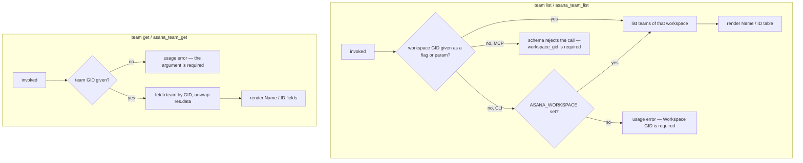

# teams — the workspace's roster of groups

## What

An Asana **team** is a named group of people inside a workspace. Projects belong to teams, and
people are brought into work through them. So a caller who wants to create a project, or to explain
who owns what, first needs a team's identifier — its **GID**.

This node is how that identifier is found and read. It offers exactly two reads: list the teams of
one workspace, and fetch one team by GID. Both are available on the CLI and over MCP, and both go
through one `api.ts`, so the two surfaces cannot drift apart.

The shape of the domain drives the one decision worth naming. Asana has no global "list all teams"
call — teams live *inside* a workspace, so `team list` cannot run without a workspace GID. Requiring
it as a flag would put friction on every single invocation. So `team list` takes its workspace scope
from the `ASANA_WORKSPACE` environment variable when no flag is given: set it once, and listing teams
costs one word. Reading a single team is the opposite case — `get` takes the team GID positionally
and nothing else, because Asana's team lookup is not workspace-scoped and accepting a scope that is
never sent would be a lie.

**Key terms**

- **GID** — Asana's global id for any object; an opaque string, never parsed and never arithmetic.
- **Team** — a named group of people inside one workspace; projects hang off teams.
- **Workspace** — the top-level Asana container a team lives in. See
  [workspaces](../workspaces/README.md).
- **Scope** — the workspace GID a list call is taken against, as opposed to the GID of the thing
  being read.

**Non-goals.** This node wraps **reading** teams only. Asana's `TeamsApi` also offers team creation,
rename, membership add/remove, and "the teams a given user belongs to"; none is wrapped. Creating
and renaming teams is org administration — done rarely, by a human, in the Asana UI — and membership
changes decide who can see what, which is not a blast radius an agent-facing CLI should carry for a
lookup use case. Membership is also not team-shaped from a caller's point of view; who is in a
workspace is answered by [users](../users/README.md).

The one unwrapped *read* — the teams a given user belongs to — is a gap rather than a cut.
`GET /users/{gid}/teams` is an ordinary paginated read with no blast radius, so the administration
rationale above does not reach it; it was simply never asked for, and nothing in the source or
history records a decision. Asana's own MCP surface exposes it as a user filter on team listing,
which is where this node would put it.

**What this node does not own.** Paginated list behavior — bare array versus envelope, what `--all`
walks, where `--max-pages` stops — is the shared list contract in [axi](../axi/README.md), adopted
here rather than re-decided. Likewise the `--json` / `--toon` formats, empty-state rendering,
exit-code conventions, and the normalized-GID flag mechanism (`--workspace-gid` with its legacy
`--workspace` alias). This node decides only that `list` is paginated, that `get` is not, and where
each entry point's GIDs come from.

## Use Cases

**Subject** — finding the teams of a workspace and reading one team by GID, over the two surfaces
(CLI and MCP) that share one `api.ts`.

| Entry point | Trigger | Inputs | Outcome |
|---|---|---|---|
| `team list` (CLI) | operator or agent needs the teams of a workspace | a workspace GID by flag or from `ASANA_WORKSPACE`, plus pagination options | the workspace's teams, rendered as a Name/ID table in text mode |
| `asana_team_list` (MCP) | agent needs the same listing over MCP | `workspace_gid` (required) plus the shared pagination params | the same result, JSON-serialized |
| `team get <gid>` (CLI) | caller holds a team GID and wants that team's record | the team GID, positionally | the unwrapped team record, rendered as Name/ID fields in text mode |
| `asana_team_get` (MCP) | same, over MCP | `team_gid` | the same record, JSON-serialized |

## Logic

The two groups share no decision, so they are drawn as separate sub-graphs.

`list`'s load-bearing edge is the fallback: a missing flag is not an error on the CLI until the
environment has also been consulted. That is what makes `team list` a one-word command in a
configured shell. The same fallback is deliberately **absent** over MCP, where `workspace_gid` is a
required parameter — an MCP client has no shell of its own to configure, so an environment default
there would silently bind every tool call to whatever the server process happened to be started
with.

`get`'s load-bearing edge is what it does *not* branch on. There is no workspace input at all: the
team GID alone identifies the team, so accepting a workspace would advertise a scoping that is never
sent.

## Scenario map

### `team list` / `asana_team_list`

| Edge | Path (Given) | Scenario |
|---|---|---|
| workspace GID given → list that workspace | a workspace holding two teams | `list returns the teams of the workspace it was given` |
| no flag → environment fallback | `ASANA_WORKSPACE` set, no flag passed | `list falls back to the workspace environment variable` |
| no flag, no environment → usage error | neither flag nor environment supplies a workspace | `list without a workspace GID anywhere is a usage error` |
| no environment fallback over MCP (barred) | the registered MCP tool set | `asana_team_list requires an explicit workspace GID` |
| render Name / ID table | text mode, two teams | `list renders each team's name and GID in text mode` |

### `team get` / `asana_team_get`

| Edge | Path (Given) | Scenario |
|---|---|---|
| team GID given → fetch | a GID naming an existing team | `get returns the team record for the GID it was given` |
| team GID absent → usage error | no positional argument | `get without a GID is a usage error` |
| no workspace scoping (barred) | `ASANA_WORKSPACE` set and a team GID given | `get takes no workspace scope` |
| render Name / ID fields | text mode, one team | `get renders the team's name and GID in text mode` |

## References

- Asana API — [Teams](https://developers.asana.com/reference/teams) backs two claims: that teams are
  listed per workspace with no global listing, and that creation, rename, membership, and
  teams-for-user are the remaining `TeamsApi` operations this node leaves unwrapped.
