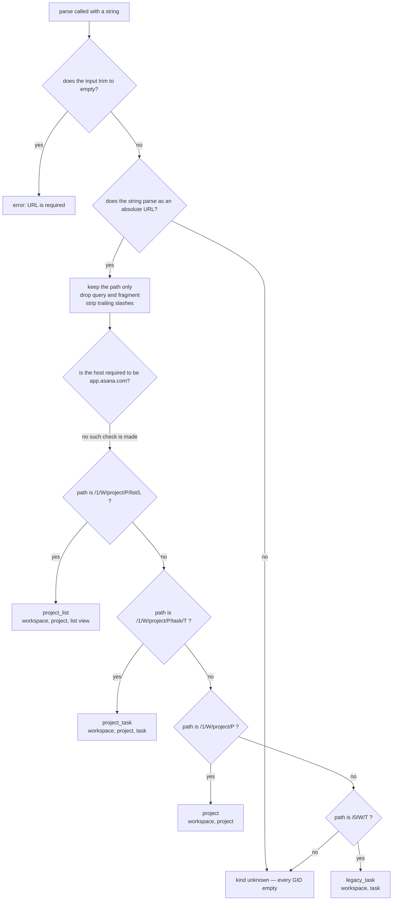

# url — turning a pasted link into GIDs, without asking Asana

## What

People do not hand an agent a GID. They paste a link — the thing their browser address bar shows
while they are looking at the task or the project they mean. Every other capability in cyber-asana
needs the **GID** instead: Asana's opaque numeric id for an object.

`url` is the translator between the two. It takes one string and reports what kind of Asana screen
it points at, plus the GIDs buried in the path — workspace, project, task, list view. It is **pure
computation**: no network call, no Asana token, no configuration. That is the load-bearing property.
Because resolving a link costs nothing and can fail cheaply, any other capability can run a pasted
link through it *before* the first API call, instead of guessing an id or spending a round trip to
find out the link was not an Asana link at all.

The whole grammar lives in the URL's **path**. Asana's modern app paths start `/1/<workspace>/…`;
older links start `/0/<workspace>/<task>`. Nothing else in the URL — the host, the scheme, the query
string, the fragment — carries an id, so nothing else is consulted.

**Key terms**

- **GID** — Asana's global id for an object; an opaque digit string, never parsed or arithmetic.
- **Kind** — which shape of Asana screen the link points at: `project_list`, `project_task`,
  `project`, `legacy_task`, or `unknown`.
- **Path** — the part of a URL after the host and before any `?` query or `#` fragment.
- **List-view GID** — the browser's id for a project's list view. It is *not* a Sections API section
  GID, and the MCP tool description says so outright, because the two look alike (both are bare
  digit strings) and confusing them sends a caller to the wrong API.

**Non-goals.** This node does not **resolve** anything — it never confirms the task exists, never
fetches its name, never checks the token can reach the workspace. It reports what the string says
and stops. Resolution is a network act and belongs to the resource domain that owns the object
([tasks](../tasks/README.md), [projects](../projects/README.md)). Keeping the two apart is what lets
the parse stay free and total: a caller can parse first, decide whether the link is worth an API
call, and only then spend one. Nor does it **build** URLs; it only reads them. And it does not
recognize every Asana screen — portfolio, team, inbox and search links are reported as `unknown`
rather than half-parsed, because a wrong GID is worse than no GID.

**What this node does not own.** The `--json` / `--toon` output formats, exit codes, and error
rendering are the shared CLI/MCP contract in [axi](../axi/README.md), adopted here rather than
re-decided. What this node owns is the parse grammar itself and the no-network property.

## Use Cases

**Subject** — reading an Asana app URL into a kind plus GIDs, over three surfaces: a CLI verb, an
MCP tool, and the exported function the other domains call in-process.

| Entry point | Trigger | Inputs | Outcome |
|---|---|---|---|
| `parseAsanaUrl(input)` (exported function) | another domain holds a user-pasted link and needs GIDs before it can call the API | one URL string | a result carrying `kind`, the original `url`, and `workspace_gid` / `project_gid` / `task_gid` / `list_view_gid`, each either a digit string or empty |
| `url parse <url>` (CLI) | an operator or agent at a shell wants the GIDs out of a link | the URL, positionally | the same result, rendered as labelled fields in text mode |
| `asana_url_parse` (MCP) | an agent over MCP wants the GIDs out of a link before choosing which tool to call | `url` | the same result, JSON-serialized |

All three surfaces run the same function, so there is one grammar to change, not three.

## Logic

The load-bearing edges:

- **Every shape ends in a different GID assignment.** The three-segment list-view path and the
  three-segment task path are the same length and made of the same digit strings; only the literal
  word `list` versus `task` tells them apart, and getting it wrong hands a caller a list-view id
  where a task id was meant. This is why each shape is matched whole, anchored at both ends, rather
  than scanned for numbers.
- **A path that matches nothing is `unknown`, never a partial answer.** A link one segment longer
  than a recognized shape falls here too — the anchored match is a deliberate refusal to guess which
  of the numbers present was the one the caller wanted.
- **A string that is not an absolute URL is `unknown`, not an error.** Only an empty string is an
  error. The distinction is that "you gave me nothing" is a caller mistake, while "this link is not
  one I recognize" is an ordinary, expected answer the caller is meant to branch on.
- **The host is never inspected.** The decision graph never reaches for it, so scheme and domain do
  not gate the parse; the path alone decides.

  The host is unreachable rather than tolerated: `pathnameFromUrl` hands the pattern table a pathname
  and nothing else, so no rule can consult scheme or domain. The result is correct either way — every
  documented Asana URL form lives under `app.asana.com` in every data region, and the grammar is
  anchored and specific enough that a matching path on another origin is a link to Asana content
  rather than a collision.

## Known gaps

**Longer paths are `unknown` because every pattern is anchored at both ends**, not because ambiguity
was weighed. Asana's V1 scheme publishes longer forms that still carry an unambiguous task GID in its
known slot — notably the comment permalink `/1/<workspace>/project/<project>/task/<task>/comment/<id>`
— so a pasted comment link parses as `unknown` today when it could degrade to `project_task`. The
same is true of `/project/<id>/<view_name>` and `/project/<id>/view/<view_id>`. That is a gap in
coverage of the V1 grammar, not a decision.

## Scenario map

### `parseAsanaUrl` — the grammar

| Edge | Path (Given) | Scenario |
|---|---|---|
| `/1/W/project/P/list/L` → project_list | a project list-view path | `a project list-view URL yields the workspace, project, and list-view GIDs` |
| `/1/W/project/P/task/T` → project_task | a task path under a project | `a project task URL yields the task GID and leaves the list-view GID empty` |
| `/1/W/project/P` → project | a project path with nothing after the project GID | `a project URL yields only the workspace and project GIDs` |
| `/0/W/T` → legacy_task | a legacy two-number path under /0/ | `a legacy task URL yields the workspace and task GIDs and no project GID` |
| no shape matches → unknown | a path naming a resource other than project or task | `a portfolio URL is reported as unknown with every GID empty` |
| no shape matches → unknown | a task path carrying one extra trailing segment | `a task URL with an extra trailing segment is reported as unknown` |
| not an absolute URL → unknown | a string that starts at the host, with no scheme | `a scheme-less Asana path is reported as unknown` |
| strip trailing slashes | a project path written with a trailing slash | `a trailing slash does not change the parse` |
| drop query and fragment | a list-view path carrying a query string and a fragment | `a query string and a fragment are ignored` |
| trim the input | a project URL padded with spaces on both sides | `surrounding whitespace is trimmed before parsing` |
| input trims to empty → error | a string made only of spaces | `a blank URL string is rejected` |
| host required to be app.asana.com (barred) | a project path served from a different Asana host | `the host is not required to be app.asana.com` |

### `url parse` (CLI)

| Edge | Path (Given) | Scenario |
|---|---|---|
| render labelled fields | text mode, a task URL | `parse prints the kind and the populated GID fields in text mode` |
| no network, no token | ASANA_TOKEN unset, a project URL | `parse succeeds with no Asana token set and reaches no network` |

### `asana_url_parse` (MCP)

| Edge | Path (Given) | Scenario |
|---|---|---|
| JSON-serialize the result | a list-view URL over MCP | `asana_url_parse returns the parse result as JSON text` |
