# users — who is in this workspace, and who am I

## What

Almost everything an agent does in Asana eventually names a person: an assignee, a follower, a
comment author. A person in Asana is a **user**, identified by a **GID** (Asana's opaque global id).
`users` is the capability that turns a workspace into a list of people, turns a user GID into that
person's record, and answers the question an agent asks first — **which user is this token?**

That last question is the one that makes this node more than a lookup. An agent handed a personal
access token knows the token, not the person behind it. Without `me`, it cannot assign a task to
"myself", filter "my tasks", or say who is speaking. Asana answers it with a quirk rather than a
separate endpoint: the string `me` is accepted **in place of** a user GID. This node wraps that
quirk as its own entry point so callers never have to know the trick.

The Asana users collection also differs from every other list in the API: it does not take a page
size. So `user list` is the one list surface in cyber-asana that offers no `--limit`, and whose MCP
tool omits the `limit` parameter. That asymmetry is this node's decision to carry, and it is
specified here rather than in the shared list contract.

**Key terms**

- **GID** — Asana's global id for any object; an opaque string, never parsed.
- **User** — a person in Asana. Their compact record is a GID and a name; the email address only
  appears when the caller asks for it via optional fields.
- **`me` sentinel** — the literal string `me`, which Asana accepts where a user GID is expected and
  resolves to the token's own user.
- **Workspace** — the top-level Asana container a user listing is scoped to; see
  [workspaces](../workspaces/README.md).

**Non-goals.** This node **reads** users only — `list`, `get`, `me`. It creates, renames and deletes
nothing, because Asana has no such API: user accounts are provisioned and removed through org
administration, not through the work API, so there is nothing to wrap. Two read shapes the Asana
users API does offer are also left unwrapped: filtering the listing to one **team**
(`GET /users?team=`), and reading a user's **favorites** (`GET /users/{gid}/favorites`). Favorites is
a non-goal — it returns the authenticated user's own sidebar ordering, which answers nothing about
who to assign work to. Team-scoped listing is a known gap: Asana's own MCP surface offers it as a
filter on user listing, and it is the natural narrowing for a workspace whose user list runs to the
endpoint's 2000-record ceiling.

**What this node does not own.** How a paginated list behaves in general — bare array versus
envelope, what `--all` walks, where `--max-pages` stops — is the shared list contract in
[axi](../axi/README.md), adopted here rather than re-decided. Likewise `--json` / `--toon`,
empty-state rendering, and exit-code conventions. What this node decides is narrower: that `list`
carries **no page-size input at all**, on either surface, and sends none to Asana.

## Use Cases

**Subject** — listing the people in a workspace, reading one person by GID, and resolving the
authenticated user, over the two surfaces (CLI and MCP) that share one `api.ts`.

| Entry point | Trigger | Inputs | Outcome |
|---|---|---|---|
| `user list` (CLI) | caller needs the people in a workspace | workspace GID via `--workspace-gid` (legacy alias `--workspace`, defaulted from `ASANA_WORKSPACE`), plus `--offset` and `--opt-fields` | the workspace's users, rendered as a Name/ID/Email table in text mode |
| `asana_user_list` (MCP) | agent needs the same listing over MCP | required `workspace_gid`, plus `offset` and `opt_fields` | the same result, JSON-serialized |
| `user get <gid>` (CLI) | caller holds a user GID and wants that person's record | the user GID, positionally | the unwrapped user record, rendered as Name/ID/Email fields in text mode |
| `asana_user_get` (MCP) | same, over MCP | `user_gid` | the same record, JSON-serialized |
| `user me` (CLI) | caller needs to know which person the token is | none | the authenticated user's record, rendered as Name/ID/Email fields in text mode |
| `asana_user_me` (MCP) | same, over MCP | none | the same record, JSON-serialized |

Both surfaces route through `api.ts` — neither `cli.ts` nor `mcp.ts` calls the Asana SDK directly,
so a change to what a user read means lands in one place.

## Logic

```mermaid
graph TD
  subgraph list["user list / asana_user_list"]
    L[invoked] --> LW{workspace GID resolvable?}
    LW -->|CLI: --workspace-gid, else legacy --workspace, else ASANA_WORKSPACE| LP
    LW -->|MCP: required parameter, no environment fallback| LP
    LW -->|none| LE[usage error — Workspace GID is required]
    LP{page size supplied?} -->|impossible — no page-size input is offered| LQ[send offset and optional fields only]
    LQ --> LR[render Name / ID / Email table]
    LR --> LM{user record carries an email?}
    LM -->|yes| LME[email shown in the row]
    LM -->|compact record| LMB[email column left blank]
  end

  subgraph get["user get / asana_user_get"]
    G[invoked] --> GG{user GID supplied?}
    GG -->|no| GE[usage error — the argument is required]
    GG -->|yes| GF[fetch by GID, unwrap res.data]
    GF --> GR{user record carries an email?}
    GR -->|yes| GRE[Name / ID / Email fields]
    GR -->|compact record| GRB[Name / ID fields, no email row]
  end

  subgraph me["user me / asana_user_me"]
    M[invoked with no input] --> MS[read the user endpoint at the me sentinel]
    MS --> MR[render Name / ID / Email fields]
  end
```

The three entry-point groups share no decision, so they are drawn separately.

`list`'s load-bearing edges are the workspace-GID resolution chain and the page-size edge that
**is not there**. The chain differs by surface on purpose: on the CLI the workspace GID is scope,
not subject, so defaulting it from `ASANA_WORKSPACE` saves a flag on every invocation and a wrong
default is visible in the output; on MCP the parameter is required, because an MCP server's
environment belongs to the server operator, not to the calling agent, and silently scoping to it
would make the same tool call mean different things in different deployments. The page-size edge is
barred on both surfaces and no page-size parameter is sent to Asana, because the Asana users
collection does not accept one. The trigger is the endpoint, not caution: this node lists users
through `GET /workspaces/{gid}/users`, whose query contract is `offset` and `opt_fields` only — no
page size exists to send. Asana fixes that collection at 2000 records sorted alphabetically and pages
it by offset alone. Offering a `--limit` that could not be forwarded would advertise control the API
does not give.

The email edge in `list` and `get` is the same underlying fact seen twice: an Asana user's compact
record has no email, and the two renderers disagree about what to do with that — the table keeps the
column and leaves the cell blank, while the field view drops the row entirely. Both are frozen here
because a copier that shared one renderer would break one of them.

`me` has no decision to make on input at all — it accepts nothing — and its single interesting edge
is that it reaches the ordinary user endpoint at the literal GID `me` rather than a separate
endpoint.

This node carries no list-pagination acceptance spec and no system test, unlike its siblings: the
shared spec's two vectors are built entirely from `limit` and `fetchAll`, and `user list` accepts
neither, so there was nothing to adopt. The sweep that backfilled the other ten domains passed over
users for that reason and left no bespoke replacement. Offset-only pagination against the live users
collection is therefore unverified — a known gap, not a decision.

## Scenario map

### `user list` / `asana_user_list`

| Edge | Path (Given) | Scenario |
|---|---|---|
| workspace GID resolved from the command line | the workspace flag supplied, the environment variable unset | `list scopes to the workspace GID given on the command line` |
| workspace GID resolved from the environment | no workspace flag, the environment variable set | `list falls back to the workspace environment variable` |
| workspace GID resolved from the legacy alias | the legacy workspace flag supplied, the environment variable unset | `list accepts the legacy workspace flag` |
| no workspace GID → usage error | no workspace flag, the environment variable unset | `list without any workspace GID is a usage error` |
| MCP workspace GID is a required parameter | an MCP call carrying a workspace GID | `the MCP list tool scopes to its workspace GID parameter` |
| MCP workspace GID is a required parameter | an MCP call omitting the workspace GID while the environment names a workspace | `the MCP list tool does not fall back to the workspace environment variable` |
| page-size input barred | any | `list offers no page-size option` |
| no page size sent to Asana | a request carrying an offset token | `list sends an offset but no page size to the Asana users endpoint` |
| render Name / ID / Email table | text mode, a user record carrying an email address | `list renders name, GID and email for each user in text mode` |
| render Name / ID / Email table | text mode, a compact user record | `list leaves the email column blank for a compact user record` |

### `user get` / `asana_user_get`

| Edge | Path (Given) | Scenario |
|---|---|---|
| user GID supplied → fetch | a GID naming an existing user | `get returns the user record for the GID it was given` |
| user GID absent → usage error | no positional argument | `get without a GID is a usage error` |
| render Name / ID / Email fields | text mode, a user record carrying an email address | `get renders the user's name, GID and email in text mode` |
| render Name / ID / Email fields | text mode, a compact user record | `get omits the email row for a compact user record` |

### `user me` / `asana_user_me`

| Edge | Path (Given) | Scenario |
|---|---|---|
| resolve through the `me` sentinel | a token belonging to a named person | `me resolves the authenticated user through the me sentinel` |
| no GID input accepted (barred) | any | `me takes no GID argument` |
| MCP me needs no parameters | an MCP call carrying no parameters | `the MCP me tool needs no parameters` |
| render Name / ID / Email fields | text mode, the token's user carrying an email address | `me renders the authenticated user's name, GID and email in text mode` |

## References

- Asana API — [Users](https://developers.asana.com/reference/users) backs two claims: that `me` is
  accepted wherever a user GID is expected, and that user accounts are not created or deleted
  through this API.
