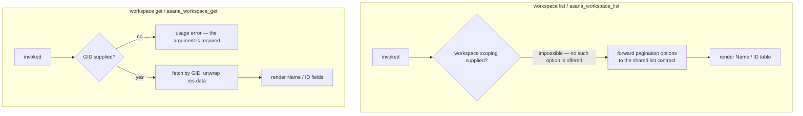

# workspaces — the entry point that needs no entry point

## What

Every other capability in cyber-asana needs to know **which Asana workspace** it is talking to. A
workspace is the top-level container an Asana account is organized into — an org, or a personal
space — and almost every Asana API call is scoped to one. Its identifier is a **GID** (Asana's
global id, an opaque numeric string).

That creates a bootstrap problem: an agent that has just been handed a token has no way to know any
GID at all. `workspaces` is the answer to it. It is the one domain whose `list` needs **no** prior
identifier — you can always call it, and what it returns is the identifier every other domain
requires. That is the whole reason the capability exists, and it is why `list` deliberately offers
no workspace-scoping option: an option that must be supplied before you can discover what to supply
would defeat the purpose.

**Key terms**

- **GID** — Asana's global id for any object; an opaque string, never parsed or arithmetic.
- **Workspace** — the top-level Asana container (an org or a personal space) that scopes almost
  every other call.
- **Envelope** — the paginated result shape (`{ data, next_page, limit, ... }`) the shared list
  contract returns, as opposed to a bare array.

**Non-goals.** This node wraps **reading** workspaces only — `list` and `get`. The Asana SDK's
`WorkspacesApi` also exposes membership management (`addUserForWorkspace`,
`removeUserForWorkspace`) and rename (`updateWorkspace`); none is wrapped, and that is deliberate
rather than pending. Those are org-administration acts with real blast radius, performed rarely and
by a human in the Asana UI, and an agent-facing CLI that can silently remove a user from an org is
a liability the discovery use case does not pay for. Adding a member is also not a workspace-shaped
operation from a caller's point of view — see [users](../users/README.md).

**What this node does not own.** How a paginated list behaves — when a bare array is returned
versus an envelope, what `--all` walks, where `--max-pages` stops — is the shared list contract in
[axi](../axi/README.md), adopted here rather than re-decided. `list` **adopts** it; this node's only
decision about pagination is that `list` is paginated at all and `get` is not. Likewise the
`--json` / `--toon` output formats and exit-code conventions are [axi](../axi/README.md)'s.

## Use Cases

**Subject** — discovering which workspaces a token can reach, and reading one by GID, over the two
surfaces (CLI and MCP) that share one `api.ts`.

| Entry point | Trigger | Inputs | Outcome |
|---|---|---|---|
| `workspace list` (CLI) | operator or agent needs to discover reachable workspaces | pagination options only (`--limit`, `--offset`, `--opt-fields`, `--all`, `--max-pages`) | the reachable workspaces, rendered as a Name/ID table in text mode |
| `asana_workspace_list` (MCP) | agent needs the same discovery over MCP | the shared pagination params | the same result, JSON-serialized |
| `workspace get <gid>` (CLI) | caller holds a GID and wants that workspace's record | the GID, positionally | the unwrapped workspace record, rendered as Name/ID fields in text mode |
| `asana_workspace_get` (MCP) | same, over MCP | `workspace_gid` | the same record, JSON-serialized |

Both surfaces route through `api.ts` — neither `cli.ts` nor `mcp.ts` calls the Asana SDK directly,
so a change to what a workspace read means lands in one place.

## Logic

The two entry-point groups share no decision, so they are drawn as separate sub-graphs. `list`'s
single interesting edge is the one that **is not there**: there is no scoping decision to make,
because no scoping input is accepted. `get`'s is that the GID is positional and required — it is
never defaulted from the `ASANA_WORKSPACE` environment variable the way a *scoping* workspace GID is
elsewhere in the CLI, because here the GID is the **subject** of the read rather than the scope of
it, and silently reading a different workspace than the one named would be worse than an error.

## Scenario map

### `workspace list` / `asana_workspace_list`

| Edge | Path (Given) | Scenario |
|---|---|---|
| no scoping input required | a token reaching two workspaces | `list returns every reachable workspace without a workspace GID` |
| no scoping option offered (barred) | any | `list offers no workspace-scoping option` |
| forward pagination options | caller passes pagination options | `list forwards its pagination options to the shared list contract unchanged` |
| render Name / ID table | text mode, two workspaces | `list renders each workspace's name and GID in text mode` |

### `workspace get` / `asana_workspace_get`

| Edge | Path (Given) | Scenario |
|---|---|---|
| GID supplied → fetch | a GID naming an existing workspace | `get returns the workspace record for the GID it was given` |
| GID absent → usage error | no positional argument | `get without a GID is a usage error` |
| no environment fallback (barred) | `ASANA_WORKSPACE` set, no GID given | `get does not fall back to the workspace environment variable` |
| render Name / ID fields | text mode, one workspace | `get renders the workspace's name and GID in text mode` |

## References

- Asana API — [Workspaces](https://developers.asana.com/reference/workspaces) backs the claim that
  membership and rename are the remaining `WorkspacesApi` operations this node deliberately leaves
  unwrapped.

## Known gaps

**`list` sets no default `opt_fields`.** AGENTS.md requires list commands to set a small default
schema when the caller gives none, and this command does not — nor do the other workspace-scoped list
commands; `task list` is the only one in the package that applies one today. The omission is a
package-wide gap against a written rule rather than a workspaces-specific choice, and it costs little
here, because Asana's compact workspace record already carries exactly the name and GID this command
renders.
